<div align="center">

# 📘 MANUAL DE USUARIO

## Sistema Inmobiliario

### Sitio Web Público + CRM Inmobiliario

**Producto:** Inmobiliaria Prime — Plataforma Web + CRM
**Versión del manual:** 1.0
**Fecha:** 23 de agosto de 2026

</div>

\pagebreak

## Ficha de control del documento

| Campo | Valor |
|---|---|
| Nombre del sistema | Sistema Inmobiliario (Web pública + CRM) |
| Documento | Manual de Usuario |
| Versión del manual | 1.0 |
| Fecha de emisión | 23 de agosto de 2026 |
| Estado | Definitivo — basado en inspección directa del sistema real |
| Audiencia | Administradores, agentes inmobiliarios, asistentes y personal nuevo |
| Idioma | Español |

> **Nota de veracidad:** todo el contenido de este manual —pantallas, campos, botones, filtros, estados y permisos— fue verificado directamente sobre el código y la aplicación en ejecución. Cuando una función descrita en un requerimiento no existe en la versión actual del sistema, este manual lo indica explícitamente en un recuadro de advertencia, en lugar de inventar un comportamiento.

\pagebreak

## Índice

**Capítulo 1.** Introducción
**Capítulo 2.** Roles del sistema

**Parte A — Sitio web público**
**Capítulo 3.** Inicio
**Capítulo 4.** Catálogo de propiedades
**Capítulo 5.** Buscar y filtrar propiedades
**Capítulo 6.** Propiedades en venta
**Capítulo 7.** Propiedades en arriendo
**Capítulo 8.** Detalle de propiedad
**Capítulo 9.** Solicitar información
**Capítulo 10.** Vender mi propiedad
**Capítulo 11.** Contacto
**Capítulo 12.** Nosotros
**Capítulo 13.** Blog
**Capítulo 14.** WhatsApp

**Parte B — CRM inmobiliario**
**Capítulo 15.** Acceso al CRM
**Capítulo 16.** Recuperar contraseña
**Capítulo 17.** Dashboard
**Capítulo 18.** Propiedades
**Capítulo 19.** Imágenes de propiedades
**Capítulo 20.** Propietarios
**Capítulo 21.** Clientes
**Capítulo 22.** Leads
**Capítulo 23.** Convertir un lead en cliente
**Capítulo 24.** Oportunidades
**Capítulo 25.** Visitas
**Capítulo 26.** Seguimientos / Actividades
**Capítulo 27.** Tareas
**Capítulo 28.** Cierres
**Capítulo 29.** Documentos
**Capítulo 30.** Blog desde el CRM
**Capítulo 31.** Usuarios
**Capítulo 32.** Agentes
**Capítulo 33.** Roles y permisos
**Capítulo 34.** Reportes
**Capítulo 35.** Exportaciones
**Capítulo 36.** Configuración y perfil

**Parte C — Flujos y referencia**
**Capítulo 37.** Flujos completos
**Capítulo 38.** Búsqueda, filtros y paginación
**Capítulo 39.** Estados del sistema
**Capítulo 40.** Mensajes del sistema
**Capítulo 41.** Solución de problemas
**Capítulo 42.** Preguntas frecuentes
**Capítulo 43.** Buenas prácticas
**Capítulo 44.** Glosario
**Capítulo 45.** Soporte

**Anexo A.** Arquitectura general del sistema

\pagebreak

# Capítulo 1 — Introducción

## 1.1 ¿Qué es el sistema?

El sistema **Inmobiliaria Prime** está compuesto por dos aplicaciones que trabajan juntas:

### Sitio web público

Es la cara visible de la inmobiliaria en internet. Cualquier persona, sin necesidad de una cuenta, puede:

- Ver el catálogo de propiedades en venta y en arriendo.
- Buscar y filtrar propiedades por ciudad, tipo, precio, habitaciones y baños.
- Consultar el detalle completo de una propiedad.
- Solicitar información sobre una propiedad específica.
- Dejar sus datos para vender o arrendar su propio inmueble.
- Leer artículos del blog.
- Contactar a la inmobiliaria por formulario, teléfono, correo o WhatsApp.

### CRM privado

Es la herramienta interna de trabajo del equipo. Con una cuenta y contraseña, el personal de la inmobiliaria puede:

- Administrar propiedades, propietarios y clientes.
- Dar seguimiento a leads (personas interesadas) y convertirlos en clientes.
- Gestionar oportunidades comerciales (el "pipeline" de negocios).
- Agendar y registrar visitas.
- Registrar seguimientos (llamadas, WhatsApp, correos, reuniones).
- Administrar tareas del equipo.
- Consultar negocios cerrados (ganados y perdidos).
- Publicar artículos de blog.
- Generar reportes y exportar información.
- Administrar usuarios del sistema (solo administradores).

## 1.2 ¿Cómo se relacionan ambas partes?

Toda la información que ve un visitante en el sitio web nace en el CRM. El flujo conceptual es el siguiente:

```text
CRM
 ↓
Se crea una propiedad
 ↓
Se marca como "Publicar en el sitio web"
 ↓
Aparece en el catálogo público (/propiedades, /comprar, /arrendar)
 ↓
Un visitante solicita información o escribe por WhatsApp
 ↓
Se registra automáticamente un Lead en el CRM (origen: "Página web")
 ↓
El equipo comercial da seguimiento, agenda visitas y trabaja la oportunidad
 ↓
El negocio se cierra (ganado o perdido)
```

> 💡 **Consejo:** si una propiedad no aparece en el sitio público, casi siempre es porque no tiene activado el interruptor **"Publicar en el sitio web"**, o porque su estado no es *Disponible* ni *Reservado*. Ver [Capítulo 18](#capítulo-18--propiedades).

\pagebreak

# Capítulo 2 — Roles del sistema

El sistema define **tres roles fijos**, asignados por un administrador desde el módulo de Usuarios. No existe un editor de permisos personalizado: los permisos de cada rol están fijos en el sistema.

| Rol | Descripción |
|---|---|
| **Administrador** | Acceso completo. Es el único rol que puede eliminar registros, y el único que puede gestionar usuarios, agentes y ver la matriz de roles. |
| **Agente** | Puede ver, crear y editar prácticamente todos los registros comerciales (propiedades, propietarios, clientes, leads, oportunidades, visitas, seguimientos, tareas, blog). No puede eliminar registros ni administrar usuarios. |
| **Asistente** | Acceso de **solo consulta**: puede ver y exportar información, pero no puede crear, editar ni eliminar nada. |

## 2.1 Matriz de permisos

Esta tabla refleja el comportamiento **real** verificado en el sistema (backend y frontend), no una intención de diseño:

| Función | Admin | Agente | Asistente |
|---|:---:|:---:|:---:|
| Ver propiedades, propietarios, clientes, leads, oportunidades, visitas, seguimientos, tareas, cierres, blog | ✅ | ✅ | ✅ |
| Exportar (CSV/PDF) esos mismos módulos | ✅ | ✅ | ✅ |
| Ver y exportar reportes | ✅ | ✅ | ✅ |
| Crear registros en esos módulos | ✅ | ✅ | ❌ |
| Editar registros en esos módulos | ✅ | ✅ | ❌ |
| Convertir un lead en cliente | ✅ | ✅ | ❌ |
| Subir imágenes o documentos | ✅ | ✅ | ❌ |
| Marcar una imagen como portada | ✅ | ✅ | ❌ |
| Eliminar registros de cualquier módulo | ✅ | ❌ | ❌ |
| Eliminar imágenes de propiedad | ✅ | ❌ | ❌ |
| Eliminar documentos adjuntos | ✅ | ❌ | ❌ |
| Ver el módulo **Equipo** (Usuarios / Agentes / Roles) | ✅ | ❌ | ❌ |
| Crear, editar o eliminar usuarios | ✅ | ❌ | ❌ |
| Asignar o cambiar el rol de otro usuario | ✅ | ❌ | ❌ |

> ⚠️ **Importante:** un administrador **no puede eliminarse a sí mismo** ni **cambiar su propio rol**, aunque sí puede eliminar o modificar a otros administradores. El sistema **no** impide que, si solo queda un administrador, este sea eliminado por otro administrador distinto — no existe una protección de "último administrador". Tenga esto en cuenta al gestionar cuentas (ver [Capítulo 43 — Buenas prácticas](#capítulo-43--buenas-prácticas)).

> 📌 **Nota sobre "ver":** los tres roles pueden ver y listar todos los módulos comerciales; la restricción real ocurre al intentar **crear, editar o eliminar**, no al consultar.

Este manual usa iconos junto a cada procedimiento para indicar qué rol puede ejecutarlo:

- 🟢 **Todos los roles**
- 🔵 **Admin y Agente**
- 🔴 **Solo Admin**

\pagebreak

# Parte A — Sitio web público

# Capítulo 3 — Inicio

La página de inicio (`/`) es la puerta de entrada pública del sitio.

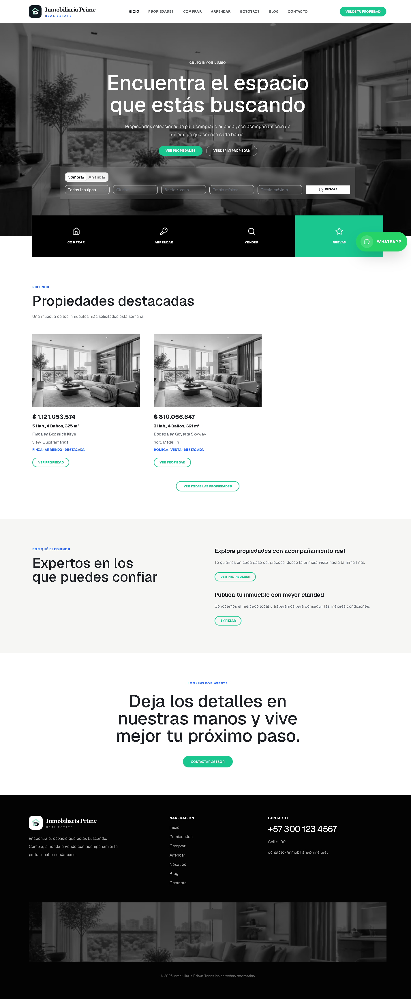

## 3.1 Elementos de la página

1. **Encabezado**: logo de la inmobiliaria, menú de navegación (Inicio, Propiedades, Comprar, Arrendar, Nosotros, Blog, Contacto), botón destacado **"Vende tu propiedad"**, y en el menú móvil un enlace **"Acceso agentes"** que lleva al login del CRM.
2. **Sección principal (hero)**: imagen de fondo tomada de una propiedad destacada, título "Encuentra el espacio que estás buscando", y el buscador rápido de propiedades.
3. **Accesos rápidos**: cuatro tarjetas — *Comprar*, *Arrendar*, *Vender*, *Nuevas* — que enlazan directamente a `/comprar`, `/arrendar`, `/vender-mi-propiedad` y `/propiedades`.
4. **Propiedades destacadas**: cuadrícula con las propiedades marcadas como destacadas desde el CRM, y un botón **"Ver todas las propiedades"**.
5. **Por qué elegirnos**: bloque de confianza con enlaces **"Ver propiedades"** y **"Empezar"**.
6. **Llamado final**: botón **"Contactar asesor"** que lleva a la página de contacto.
7. **Pie de página**: repite la navegación e incluye teléfono, dirección y correo de contacto.
8. **Botón flotante de WhatsApp** (ver [Capítulo 14](#capítulo-14--whatsapp)).

## 3.2 ¿Qué puede hacer un visitante desde aquí?

- Buscar una propiedad directamente desde el buscador principal (ver [Capítulo 5](#capítulo-5--buscar-y-filtrar-propiedades)).
- Navegar al catálogo completo, a "Comprar" o a "Arrendar".
- Ir directamente a dejar sus datos para vender su propiedad.
- Escribir por WhatsApp con un solo clic.
- Ir al blog o a la página de contacto.

\pagebreak

# Capítulo 4 — Catálogo de propiedades

Ruta: `/propiedades`.

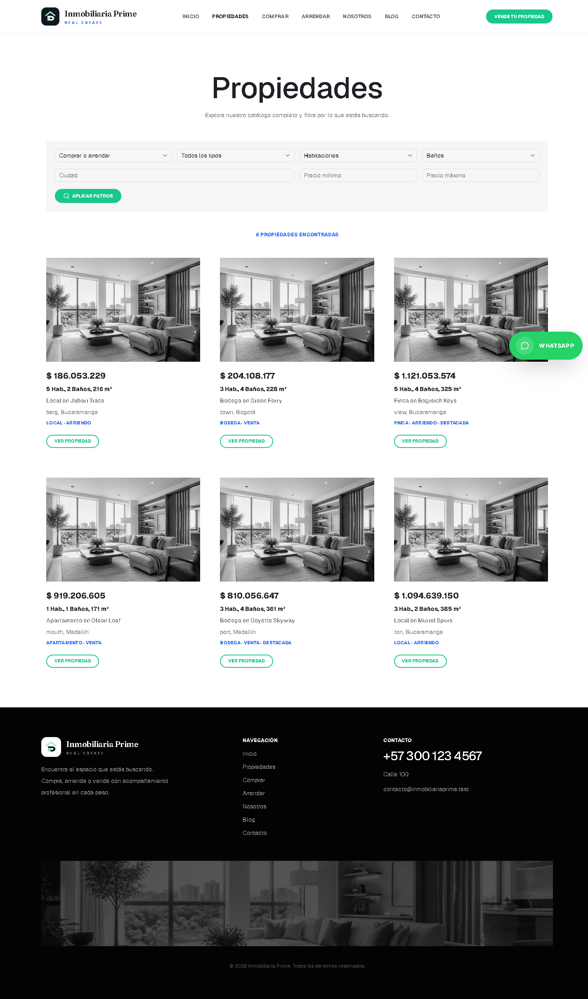

## 4.1 Elementos de la página

- Encabezado de sección con el título **"Propiedades"**.
- Bloque de filtros (ver [Capítulo 5](#capítulo-5--buscar-y-filtrar-propiedades)).
- Contador de resultados: **"{n} propiedades encontradas"**.
- Cuadrícula de tarjetas de propiedad, cada una con: imagen principal, precio (formateado en pesos colombianos), tipo de operación (venta/arriendo), ciudad/zona, y características resumidas (habitaciones, baños, área).
- Paginación en la parte inferior.

## 4.2 Paginación

La paginación solo aparece cuando hay más de una página de resultados. Incluye botones de página anterior/siguiente, números de página (con puntos suspensivos `…` si hay muchas páginas), y conserva los filtros aplicados al cambiar de página. A diferencia del CRM, el catálogo público **no** tiene un selector de cantidad de resultados por página.

\pagebreak

# Capítulo 5 — Buscar y filtrar propiedades

Existen **dos buscadores distintos** en el sitio, con campos ligeramente diferentes.

## 5.1 Buscador rápido (página de Inicio)

Ubicado en la sección principal del Home. Campos:

1. Pestañas **"Comprar"** / **"Arrendar"**.
2. Select **"Tipo de inmueble"**.
3. Campo de texto **"Ciudad"**.
4. Campo de texto **"Barrio / zona"**.
5. Campo numérico **"Precio mínimo"**.
6. Campo numérico **"Precio máximo"**.
7. Botón **"Buscar"**.

Al presionar "Buscar", el sitio lo lleva al catálogo (`/propiedades`) con los filtros ya aplicados en la URL.

## 5.2 Filtros del catálogo (`/propiedades`, `/comprar`, `/arrendar`)

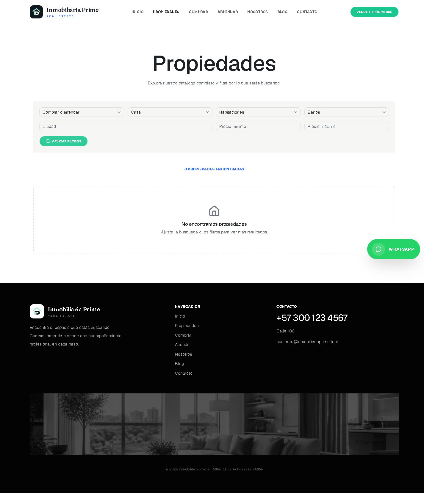

Campos disponibles:

1. Select **"Comprar o arrendar"** — no aparece en `/comprar` ni en `/arrendar`, porque en esas páginas la operación ya viene fija.
2. Select **"Tipo de inmueble"** — Apartamento, Casa, Oficina, Local, Lote, Bodega, Finca, Otro.
3. Select **"Habitaciones"** — "1+ habitaciones" hasta "5+ habitaciones".
4. Select **"Baños"** — "1+ baños" hasta "4+ baños".
5. Campo de texto **"Ciudad"**.
6. Campo numérico **"Precio mínimo"**.
7. Campo numérico **"Precio máximo"**.
8. Botón **"Aplicar filtros"**.

### Procedimiento

1. Ingrese a **Propiedades**, **Comprar** o **Arrendar** según lo que busca.
2. Seleccione el tipo de inmueble (opcional).
3. Indique la ciudad (opcional).
4. Seleccione habitaciones y/o baños mínimos (opcional).
5. Ajuste el rango de precio (opcional).
6. Presione **"Aplicar filtros"**.

> ⚠️ **Esta función no está disponible en la versión actual:** el catálogo (`/propiedades`, `/comprar`, `/arrendar`) no tiene un campo de filtro por **barrio/zona**, aunque el buscador rápido del Home sí lo tiene. Tampoco existe un filtro de rango de baños/habitaciones (solo "mínimo").

\pagebreak

# Capítulo 6 — Propiedades en venta

Ruta: `/comprar`.

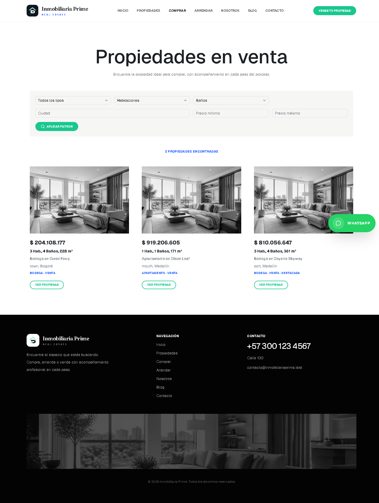

Esta página reutiliza el mismo catálogo del Capítulo 4, pero:

- El título de la sección es **"Propiedades en venta"**.
- El tipo de operación queda fijo en "Venta": el selector "Comprar o arrendar" no aparece, porque no aplica.
- Solo se muestran propiedades cuyo tipo de operación es **venta**.

El resto del comportamiento (filtros de tipo, ciudad, precio, habitaciones, baños, paginación) es idéntico al catálogo general.

\pagebreak

# Capítulo 7 — Propiedades en arriendo

Ruta: `/arrendar`.

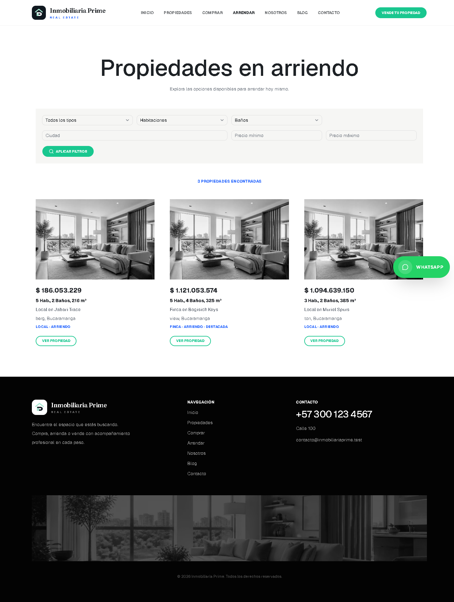

Igual que el capítulo anterior, pero mostrando únicamente propiedades en **arriendo**, con título **"Propiedades en arriendo"**.

\pagebreak

# Capítulo 8 — Detalle de propiedad

Al hacer clic en cualquier tarjeta del catálogo, se abre la página de detalle (`/propiedades/[slug]`).

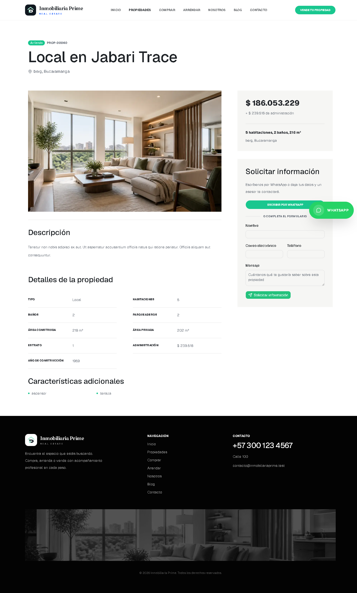

## 8.1 Elementos de la página

1. **Distintivo de operación** (Venta/Arriendo) y **código de la propiedad** (ej. `PROP-00001`).
2. **Título** de la propiedad y **ubicación** (zona, ciudad).
3. **Galería de fotografías.**
4. **Descripción** (si el agente la escribió al crear la propiedad).
5. **Detalles de la propiedad**: Tipo, Habitaciones, Baños, Parqueaderos, Área construida (m²), Área privada (m²), Estrato, Administración, Año de construcción. Solo se muestran los datos que realmente se cargaron; los campos vacíos no aparecen.
6. **Características adicionales**: lista libre de características, si el agente las registró.
7. **Panel lateral fijo**: precio (y valor de administración si aplica), resumen de habitaciones/baños/área, ubicación, y el bloque de contacto ("Solicitar información").

## 8.2 Ver fotografías

Recorra la galería para ver todas las imágenes cargadas de la propiedad. La primera imagen (o la marcada como "portada" desde el CRM) es la que se usa como imagen principal en el catálogo.

## 8.3 Revisar características

Toda la información técnica del inmueble está en el bloque "Detalles de la propiedad" y, si aplica, en "Características adicionales".

## 8.4 Solicitar información

Ver [Capítulo 9](#capítulo-9--solicitar-información).

## 8.5 Contactar por WhatsApp

El panel de contacto incluye un botón **"Escribir por WhatsApp"** que abre WhatsApp con un mensaje prellenado:

> *"Hola, estoy interesado en la propiedad {código} - {título}."*

\pagebreak

# Capítulo 9 — Solicitar información

Este formulario aparece en la página de detalle de cada propiedad, debajo del botón de WhatsApp.

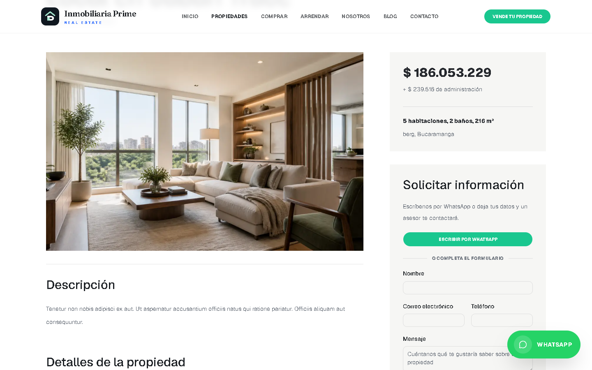

## 9.1 Campos del formulario

| Campo | Obligatorio | Notas |
|---|:---:|---|
| Nombre | Sí | — |
| Correo electrónico | Condicional | Debe indicar correo **o** teléfono (al menos uno) |
| Teléfono | Condicional | Debe indicar correo **o** teléfono (al menos uno) |
| Mensaje | No | Placeholder: "Cuéntanos qué te gustaría saber sobre esta propiedad" |

Botón: **"Solicitar información"**.

## 9.2 ¿Qué ocurre después de enviarlo?

Al enviar el formulario correctamente aparece un mensaje de confirmación: **"¡Gracias por tu mensaje!"** / *"Un asesor se pondrá en contacto contigo muy pronto."*

**El contacto se registra automáticamente como un Lead dentro del CRM**, con origen **"Página web"** y estado inicial **"Nuevo"**, quedando disponible para que el equipo comercial le dé seguimiento (ver [Capítulo 22 — Leads](#capítulo-22--leads)).

\pagebreak

# Capítulo 10 — Vender mi propiedad

Ruta: `/vender-mi-propiedad`. Pensada para propietarios que quieren **vender o arrendar** su inmueble a través de la inmobiliaria.

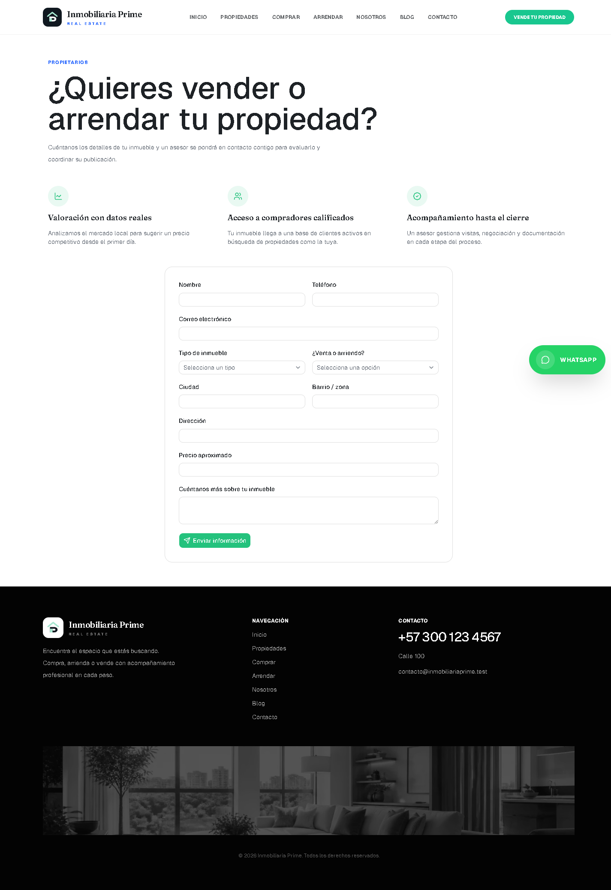

## 10.1 Cómo acceder

Desde cualquier página pública, use el botón **"Vende tu propiedad"** del encabezado, o cualquiera de los enlaces "Vender" repartidos por el sitio.

## 10.2 Campos del formulario

| Campo | Obligatorio |
|---|:---:|
| Nombre | Sí |
| Teléfono | Condicional (correo o teléfono) |
| Correo electrónico | Condicional (correo o teléfono) |
| Tipo de inmueble | Sí |
| ¿Venta o arriendo? | Sí |
| Ciudad | Sí |
| Barrio / zona | No |
| Dirección | No |
| Precio aproximado | No |
| Cuéntanos más sobre tu inmueble | No |

Botón: **"Enviar información"**.

## 10.3 Confirmación

Al enviarse correctamente: **"¡Gracias por tu información!"** / *"Un asesor revisará los datos de tu inmueble y se pondrá en contacto contigo muy pronto."*

## 10.4 ¿Qué sucede en el CRM?

Se crea un **Lead** con origen "Página web" y estado "Nuevo", igual que en el Capítulo 9, pero marcado internamente con la intención "Vender propiedad" para que el equipo sepa que se trata de un propietario captado, no de un comprador/arrendatario.

\pagebreak

# Capítulo 11 — Contacto

Ruta: `/contacto`.

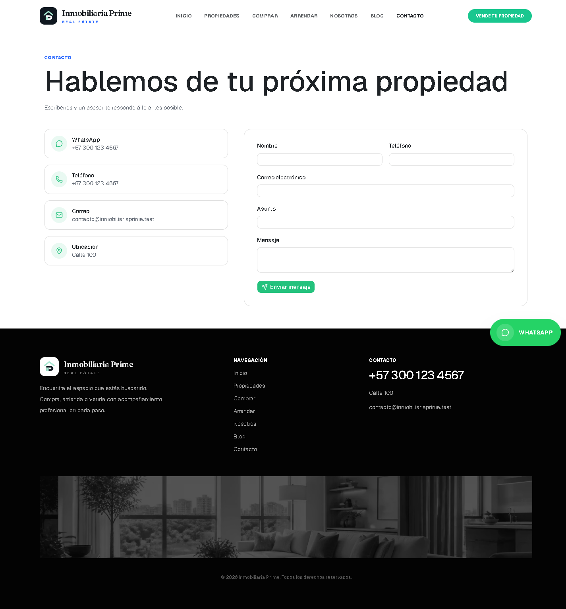

## 11.1 Información de contacto

La página muestra tarjetas con: WhatsApp, Teléfono, Correo electrónico y Ubicación de la inmobiliaria.

## 11.2 Formulario de contacto

| Campo | Obligatorio |
|---|:---:|
| Nombre | Sí |
| Teléfono | Condicional (correo o teléfono) |
| Correo electrónico | Condicional (correo o teléfono) |
| Asunto | No |
| Mensaje | Sí |

Botón: **"Enviar mensaje"**.

Confirmación: **"¡Gracias por escribirnos!"** / *"Te responderemos a la brevedad posible."* También genera un Lead en el CRM (intención "Contacto general").

\pagebreak

# Capítulo 12 — Nosotros

Ruta: `/nosotros`.

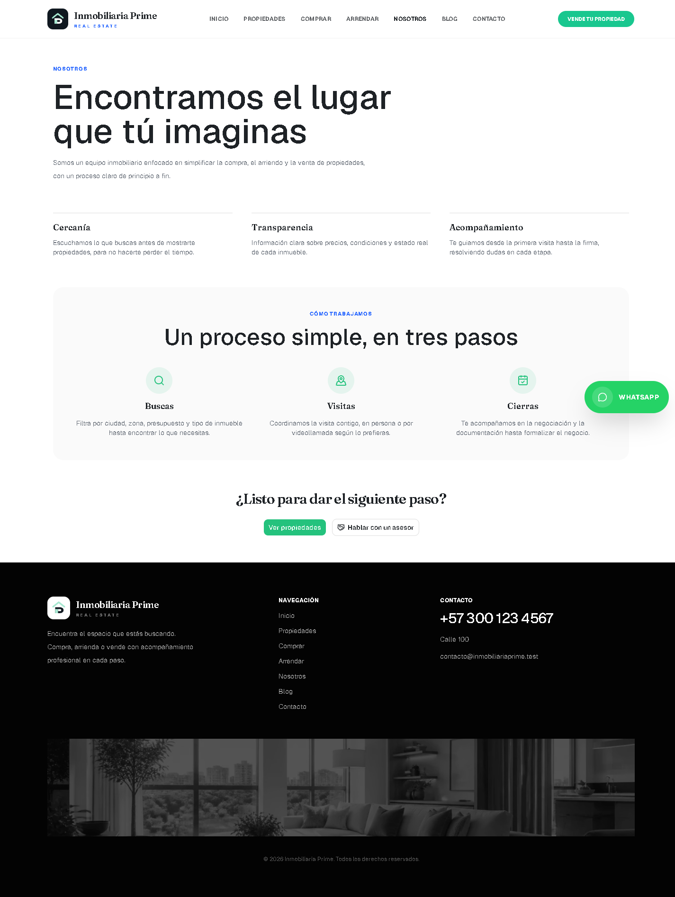

Página informativa, sin formularios. Incluye:

- Encabezado de presentación de la inmobiliaria.
- Tres valores: *Cercanía*, *Transparencia*, *Acompañamiento*.
- Bloque **"Cómo trabajamos"** en tres pasos: *Buscas → Visitas → Cierras*.
- Llamado final con botones **"Ver propiedades"** y **"Hablar con un asesor"**.

\pagebreak

# Capítulo 13 — Blog

## 13.1 Listado de artículos

Ruta: `/blog`.

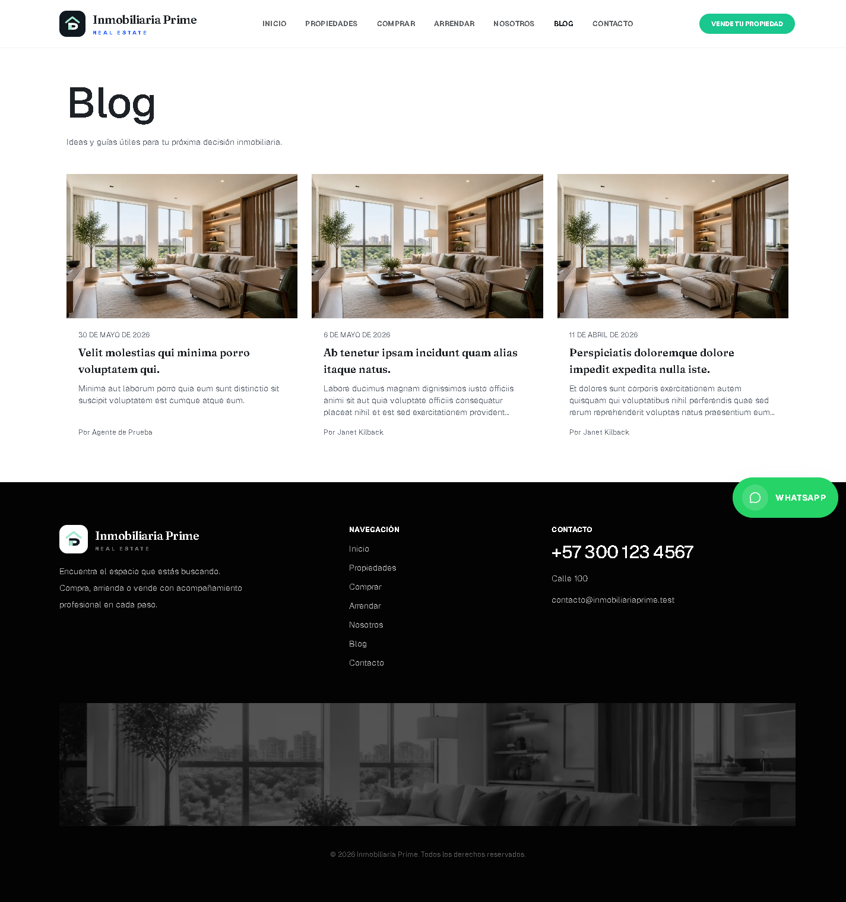

Cuadrícula de tarjetas de artículo, cada una con imagen, fecha de publicación, título, extracto y autor ("Por {nombre}"). Si todavía no hay artículos publicados, se muestra el mensaje **"Todavía no hay artículos publicados."** Incluye la misma paginación del catálogo de propiedades.

## 13.2 Detalle de artículo

Ruta: `/blog/[slug]`.

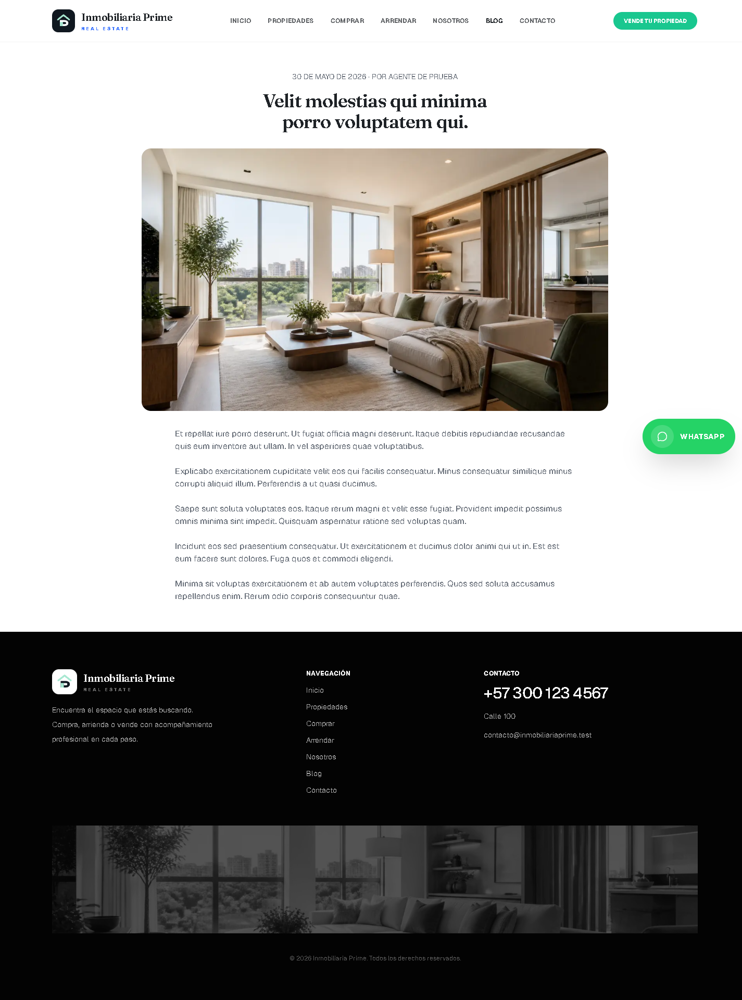

Muestra fecha y autor, título, imagen de portada, y el contenido completo del artículo. No tiene sección de comentarios.

\pagebreak

# Capítulo 14 — WhatsApp

El botón flotante de WhatsApp aparece en **todas** las páginas públicas, generalmente en la esquina inferior derecha.

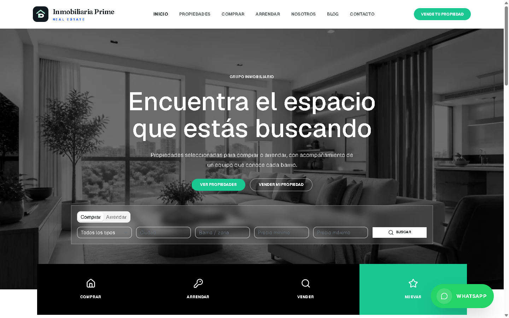

## 14.1 Cómo funciona

1. Presione el botón flotante **"WhatsApp"**.
2. Se abre WhatsApp (aplicación o web) con el número de contacto de la inmobiliaria.
3. El mensaje aparece **prellenado**, aunque el texto exacto cambia según dónde se presione el botón:
   - Botón flotante general: *"Hola, quiero más información sobre las propiedades."*
   - Botón de WhatsApp en el detalle de una propiedad: *"Hola, estoy interesado en la propiedad {código} - {título}."*
   - Tarjeta de WhatsApp en Contacto: *"Hola, quiero más información."*

> 📌 El número de WhatsApp se configura una sola vez a nivel de todo el sitio; no se cambia por página.

\pagebreak

# Parte B — CRM inmobiliario

# Capítulo 15 — Acceso al CRM

Ruta: `/login`.

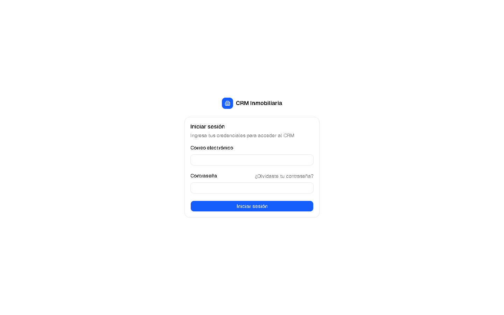

## 15.1 Campos

| Campo | Tipo |
|---|---|
| Correo electrónico | Texto (email) |
| Contraseña | Contraseña |

Botón: **"Iniciar sesión"**. Junto al campo de contraseña hay un enlace **"¿Olvidaste tu contraseña?"** (ver [Capítulo 16](#capítulo-16--recuperar-contraseña)).

Si las credenciales son incorrectas, se muestra un mensaje de error en rojo (el texto exacto depende del backend; si no hay uno específico, se muestra **"No fue posible iniciar sesión"**).

## 15.2 Usuarios de prueba

El seeder de datos de demostración crea estas cuentas (todas con la misma contraseña):

| Correo | Rol | Contraseña |
|---|---|---|
| `admin@crm.test` | admin | `password` |
| `agente@crm.test` | agente | `password` |
| `asistente@crm.test` | asistente | `password` |

> ⚠️ **Importante:** estas credenciales son exclusivamente para el entorno de pruebas/demostración. En un entorno de producción real, cada usuario del equipo debe tener su propia cuenta y contraseña personal (ver [Capítulo 31 — Usuarios](#capítulo-31--usuarios) y [Capítulo 43 — Buenas prácticas](#capítulo-43--buenas-prácticas)).

## 15.3 Procedimiento de acceso

1. Abra `/login` en el navegador.
2. Ingrese su correo electrónico y contraseña.
3. Presione **"Iniciar sesión"**.
4. Será redirigido automáticamente al [Dashboard](#capítulo-17--dashboard).

\pagebreak

# Capítulo 16 — Recuperar contraseña

Esta función **sí existe** en el sistema, con un flujo de dos pasos.

## 16.1 Solicitar el enlace de recuperación

Ruta: `/forgot-password` (se llega desde el enlace "¿Olvidaste tu contraseña?" del login).

1. Ingrese su **correo electrónico**.
2. Presione **"Enviar enlace de recuperación"**.
3. El sistema siempre muestra el mismo mensaje de éxito, exista o no esa cuenta (medida de seguridad para no revelar qué correos están registrados): *"Si el correo está registrado, te enviamos un enlace para restablecer tu contraseña. Revisa tu bandeja de entrada."*
4. Puede volver al login con el enlace **"Volver a iniciar sesión"**.

Si el correo existe, llega un email con un enlace que **expira en 60 minutos**.

## 16.2 Restablecer la contraseña

Ruta: `/reset-password?token=...&email=...` (se abre desde el enlace del correo).

1. Complete **"Nueva contraseña"** (mínimo 8 caracteres).
2. Complete **"Confirmar contraseña"** (debe coincidir con la anterior).
3. Presione **"Restablecer contraseña"**.
4. Verá el mensaje **"Contraseña actualizada correctamente"** y será redirigido al login.

> ⚠️ Si el enlace ya expiró o es inválido (falta el token o el correo en la URL), el sistema muestra: *"Este enlace no es válido o ya expiró. Solicita uno nuevo para continuar."*, con un botón **"Solicitar nuevo enlace"**.

> 📌 Este flujo es distinto al cambio de contraseña estando **ya conectado**, que se hace desde [Configuración y perfil](#capítulo-36--configuración-y-perfil) y sí pide la contraseña actual.

\pagebreak

# Capítulo 17 — Dashboard 🟢

Ruta: `/dashboard`. Es la primera pantalla que ve cualquier usuario tras iniciar sesión, sin importar su rol.

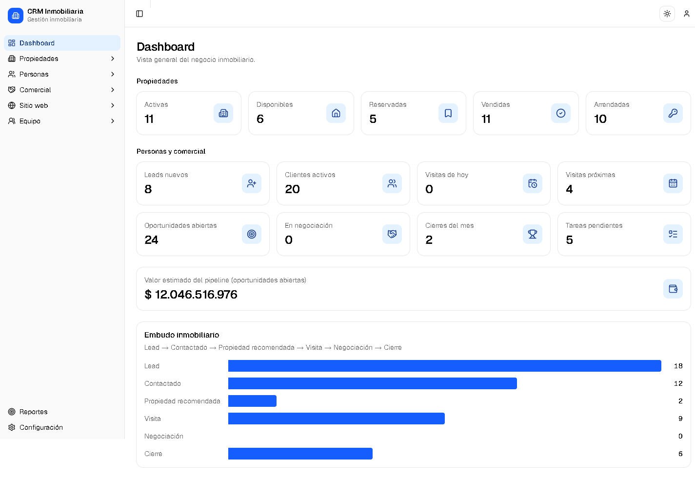

## 17.1 Bloque "Propiedades"

Cinco indicadores: **Activas**, **Disponibles**, **Reservadas**, **Vendidas**, **Arrendadas**.

## 17.2 Bloque "Personas y comercial"

Ocho indicadores: **Leads nuevos**, **Clientes activos**, **Visitas de hoy**, **Visitas próximas**, **Oportunidades abiertas**, **En negociación**, **Cierres del mes**, **Tareas pendientes**.

## 17.3 Valor del pipeline

Tarjeta destacada: **"Valor estimado del pipeline (oportunidades abiertas)"**, con la suma de todas las oportunidades abiertas, en pesos colombianos.

## 17.4 Embudo inmobiliario

Gráfico de barras horizontales titulado **"Embudo inmobiliario"**, que representa el recorrido: *Lead → Contactado → Propiedad recomendada → Visita → Negociación → Cierre*, mostrando cuántos registros hay en cada etapa.

> 📌 El Dashboard es idéntico para los tres roles: no cambia según quién inicia sesión, ya que solo consulta información (ver [Capítulo 2](#capítulo-2--roles-del-sistema)).

\pagebreak

# Capítulo 18 — Propiedades

Ruta: `/properties`. Es uno de los módulos centrales del CRM.

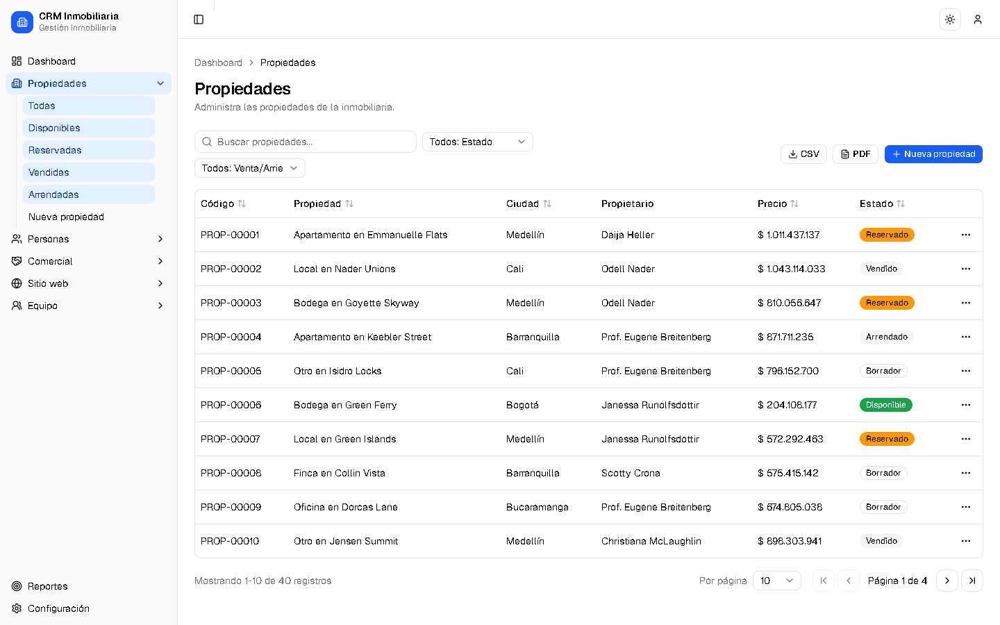

## 18.1 Listar propiedades 🟢

Columnas de la tabla: **Código**, **Propiedad** (título), **Ciudad**, **Propietario**, **Precio**, **Estado**, y una columna de acciones.

## 18.2 Buscar y filtrar 🟢

- Buscador de texto libre ("Buscar propiedades...").
- Filtro **"Estado"**: Borrador, Disponible, Reservado, Vendido, Arrendado, Inactivo.
- Filtro **"Venta/Arriendo"**: Venta, Arriendo.

## 18.3 Paginación 🟢

Selector de tamaño de página (10 / 25 / 50 / 100 registros).

## 18.4 Exportar 🟢

Botones **CSV** y **PDF** en la parte superior del listado, que exportan exactamente los resultados filtrados en pantalla.

## 18.5 Crear propiedad 🔵

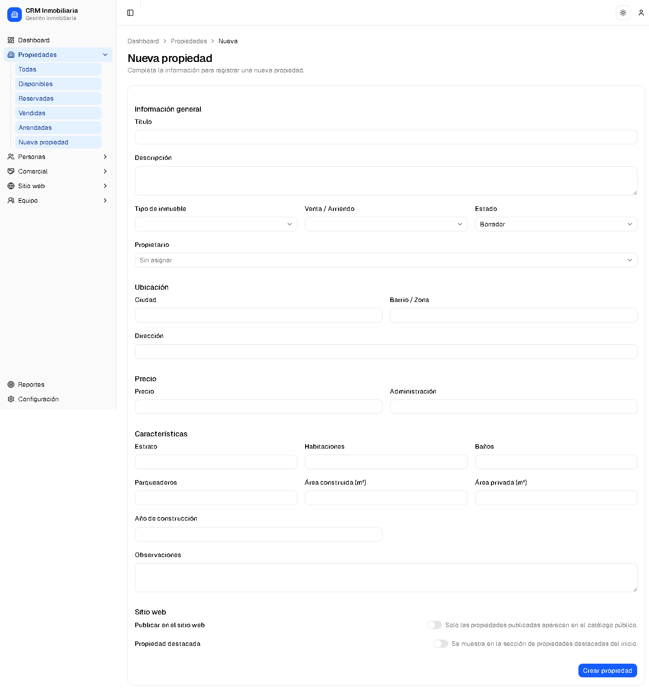

Botón **"Nueva propiedad"** (solo visible para admin/agente).

### Tutorial completo — crear una propiedad

1. Vaya a **Propiedades** en el menú lateral.
2. Presione **"Nueva propiedad"**.
3. En **Información general**, complete: Título (obligatorio), Descripción, Tipo de inmueble, Venta/Arriendo, Estado (por defecto "Borrador"), Propietario (opcional).
4. En **Ubicación**, complete: Ciudad (obligatoria), Barrio/Zona, Dirección.
5. En **Precio**, complete: Precio (obligatorio), Administración.
6. En **Características**, complete lo que aplique: Estrato, Habitaciones, Baños, Parqueaderos, Área construida, Área privada, Año de construcción, Observaciones.
7. En **Sitio web**, active el interruptor **"Publicar en el sitio web"** si desea que aparezca públicamente, y **"Propiedad destacada"** si quiere que salga en el home.
8. Presione **"Guardar"**.

> ⚠️ **Esta función no está disponible en la versión actual:** el formulario de propiedad no tiene un campo de "características adicionales" de texto libre, aunque ese dato sí puede llegar a mostrarse en la web pública si fue cargado por otra vía. Desde el formulario del CRM no se puede editar directamente.

### Cómo publicarla en la web

Con el interruptor **"Publicar en el sitio web"** activado y el **Estado** en *Disponible* o *Reservado*, la propiedad aparece automáticamente en `/propiedades`, `/comprar` o `/arrendar` según su tipo de operación.

## 18.6 Editar propiedad 🔵

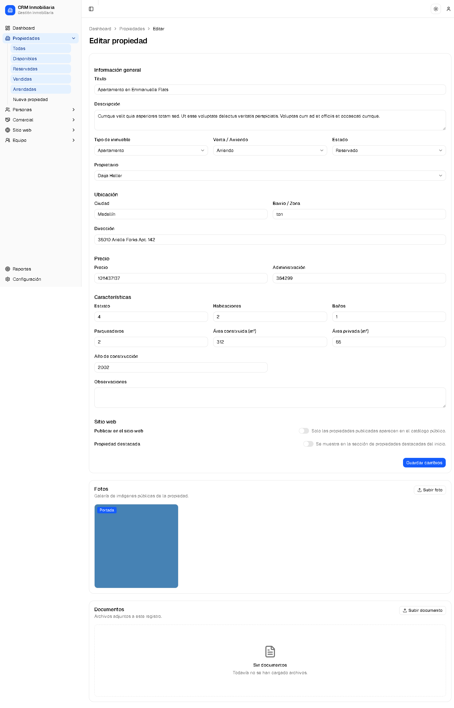

Abra la propiedad desde el listado (clic sobre la fila o "Editar" en el menú de acciones). Los mismos campos del formulario de creación quedan disponibles para modificar. Botón: **"Guardar cambios"**.

## 18.7 Publicar / despublicar

Se controla con el interruptor **"Publicar en el sitio web"** dentro del formulario de edición — no existen botones independientes de "Publicar" y "Despublicar" en el listado.

## 18.8 Destacar

Se controla con el interruptor **"Propiedad destacada"** dentro del formulario de edición.

## 18.9 Estados de una propiedad

Ver la lista completa en [Capítulo 39 — Estados del sistema](#capítulo-39--estados-del-sistema).

## 18.10 Eliminar 🔴

Solo el rol **Administrador** ve la opción **"Eliminar"** en el menú de acciones de cada fila. Al presionar, se abre un cuadro de confirmación: *"¿Eliminar este registro?"* / *"Esta acción eliminará '{título}' de forma permanente. No se puede deshacer."*, con botón de confirmación **"Eliminar"**.

\pagebreak

# Capítulo 19 — Imágenes de propiedades

Dentro de la vista de edición de una propiedad existe el panel **"Fotos"**.

## 19.1 Subir imágenes 🔵

Botón **"Subir foto"** (solo admin/agente). Formatos permitidos: JPG, JPEG, PNG, WEBP, máximo 5 MB por imagen.

## 19.2 Imagen principal (portada)

Cada imagen puede marcarse como portada con el botón de estrella **"Marcar como portada"** (admin/agente). La imagen marcada como portada muestra la insignia **"Portada"** y es la que se usa como imagen principal en el catálogo público.

## 19.3 Orden

No se documentó en este manual un control visual de arrastrar-y-soltar para reordenar imágenes manualmente en la interfaz revisada; el orden de visualización depende del campo interno `sort_order` de cada imagen.

## 19.4 Eliminar imágenes 🔴

Solo el rol **Administrador** ve el botón de eliminar (ícono de papelera) sobre cada imagen. Agente y Asistente pueden ver las imágenes pero no eliminarlas.

## 19.5 Visualización pública

Las imágenes cargadas aparecen en la galería de la página de detalle pública de la propiedad ([Capítulo 8](#capítulo-8--detalle-de-propiedad)), en el orden configurado, con la portada como primera imagen.

\pagebreak

# Capítulo 20 — Propietarios

Ruta: `/owners`.

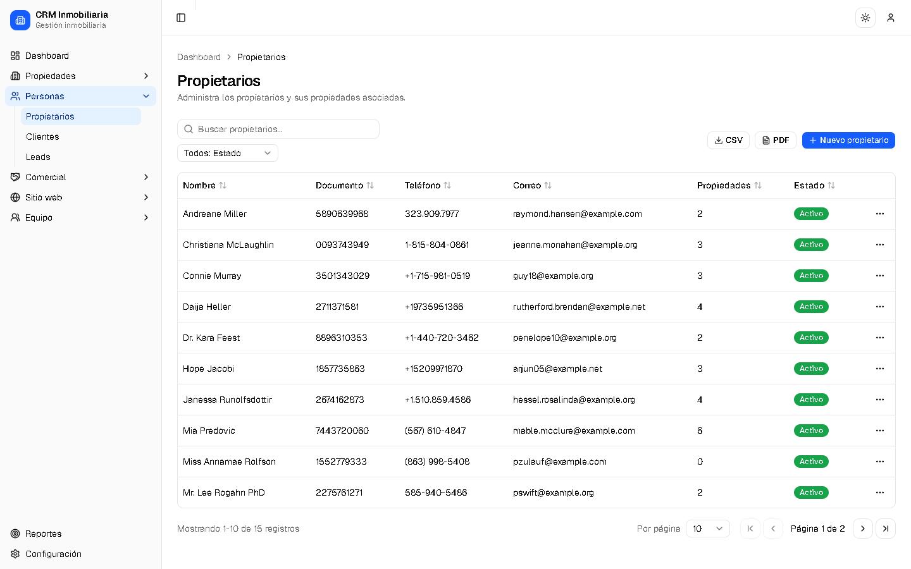

## 20.1 Listar 🟢

Columnas: **Nombre**, **Documento**, **Teléfono**, **Correo**, **Propiedades** (cantidad asociada), **Estado**, acciones.

## 20.2 Buscar y filtrar 🟢

Buscador "Buscar propietarios...", filtro **"Estado"** (Activo/Inactivo).

## 20.3 Crear 🔵

Botón **"Nuevo propietario"**. Campos: Nombre (obligatorio), Documento, Teléfono, WhatsApp, Correo electrónico, Estado (Activo/Inactivo), Dirección, Notas.

## 20.4 Editar 🔵 / Eliminar 🔴

Mismo patrón que Propiedades: "Editar" para admin/agente, "Eliminar" solo para admin.

## 20.5 Relacionar propiedades

La columna **"Propiedades"** del listado muestra cuántas propiedades tiene asociadas cada propietario. La relación se establece desde el formulario de la propiedad (campo **"Propietario"**), no desde la ficha del propietario.

## 20.6 Exportar 🟢

Botones CSV/PDF.

\pagebreak

# Capítulo 21 — Clientes

Ruta: `/clients`.

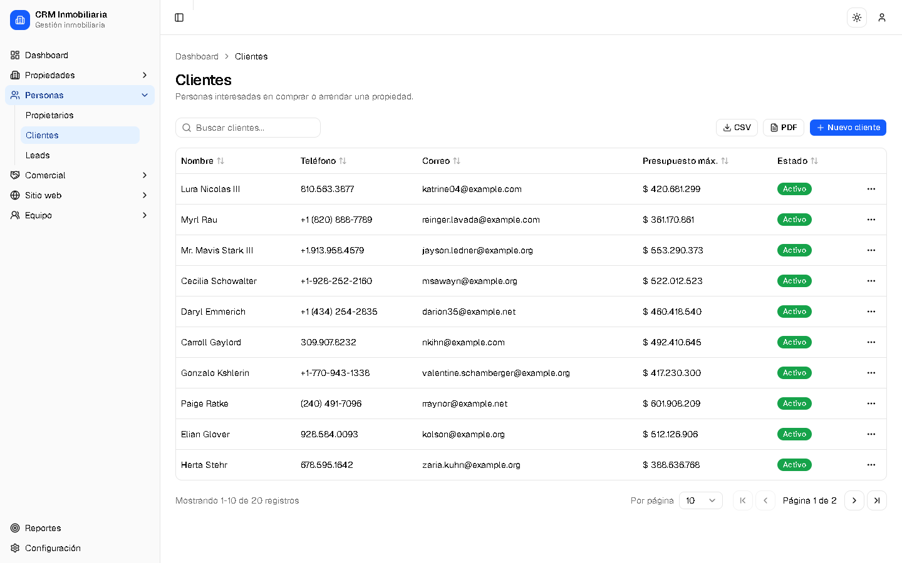

## 21.1 Listar 🟢

Columnas: **Nombre**, **Teléfono**, **Correo**, **Presupuesto máx.**, **Estado**, acciones.

## 21.2 Buscar 🟢

Buscador "Buscar clientes...". Este módulo no tiene un filtro adicional por dropdown (solo búsqueda de texto).

## 21.3 Crear 🔵

Botón **"Nuevo cliente"**. Formulario agrupado en tres bloques:

- **Contacto**: Nombre (obligatorio), Documento, Teléfono, WhatsApp, Correo.
- **Interés**: Tipo de interés (Compra/Arriendo), Tipo de inmueble buscado, Habitaciones, Presupuesto mínimo, Presupuesto máximo (debe ser mayor o igual al mínimo), Zonas de interés (texto separado por comas, ej. "Chapinero, Usaquén, Norte").
- **Seguimiento**: Estado (Activo/Inactivo), Notas.

## 21.4 Editar 🔵 / Eliminar 🔴

Mismo patrón que los módulos anteriores.

## 21.5 Estado

**Activo** (success) / **Inactivo** (secondary).

## 21.6 Exportar 🟢

Botones CSV/PDF.

\pagebreak

# Capítulo 22 — Leads

Ruta: `/leads`.

**Un lead es una persona que ha mostrado interés pero que todavía no necesariamente se ha convertido en cliente.** Por ejemplo, alguien que solicitó información sobre una propiedad desde el sitio web.

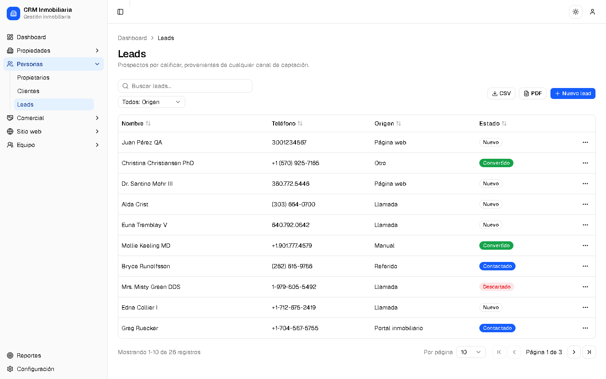

## 22.1 Listar 🟢

Columnas: **Nombre**, **Teléfono**, **Origen**, **Estado**, acciones.

## 22.2 Origen

Un lead puede provenir de: Página web, WhatsApp, Llamada, Referido, Redes sociales, Portal inmobiliario, Manual, Otro.

## 22.3 Estado

Un lead puede estar en: **Nuevo**, **Contactado**, **Calificado**, **Descartado**, **Convertido**.

## 22.4 Filtro 🟢

Dropdown **"Origen"**.

## 22.5 Crear / editar 🔵

Botón **"Nuevo lead"**. Campos: Nombre (obligatorio), Teléfono, Correo, Origen (obligatorio), Estado (obligatorio), Notas.

## 22.6 Eliminar 🔴

Solo Admin.

## 22.7 Exportar 🟢

Botones CSV/PDF.

\pagebreak

# Capítulo 23 — Convertir un lead en cliente 🔵

## 23.1 ¿Cuándo utilizarlo?

Cuando un lead deja de ser solo un interesado y ya está listo para trabajarse formalmente como cliente comercial (por ejemplo, después de confirmar su interés real por teléfono).

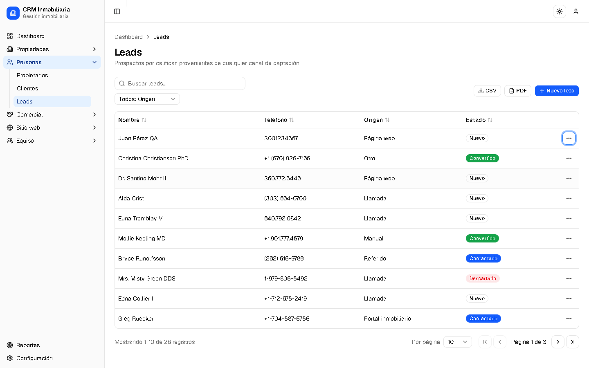

## 23.2 Botón exacto

En el menú de acciones de la fila del lead (o en su detalle), presione el botón **"Convertir a cliente"** (ícono de una persona con un check). Este botón **no aparece** si el lead ya tiene estado "Convertido", ni para el rol Asistente.

## 23.3 Procedimiento

1. Ubique el lead en `/leads`.
2. Presione **"Convertir a cliente"**.
3. Confirme en el cuadro de diálogo: *"¿Convertir este lead a cliente?"* / *"Se creará un cliente a partir de '{nombre}' y el lead quedará marcado como convertido."*
4. Presione **"Convertir"**.
5. Verá el mensaje de éxito: **"'{nombre}' convertido a cliente"**.

## 23.4 ¿Qué sucede con los datos?

- Se crea un **nuevo Cliente** copiando: nombre, teléfono, correo, agente asignado y notas del lead. El cliente queda con estado **"Activo"**.
- El **Lead original no se borra**: queda marcado con estado "Convertido" y enlazado al cliente creado, como historial.
- Un lead **no puede convertirse dos veces**: si ya está convertido, el sistema responde con un error de validación.

> ⚠️ **Esta función no está disponible en la versión actual:** los campos de interés comercial del nuevo cliente (tipo de interés, presupuesto, zonas de interés, tipo de inmueble buscado) **no se completan automáticamente** desde el lead, porque el lead no guarda esos datos. Deberá completarlos manualmente en la ficha del cliente si lo desea.

\pagebreak

# Capítulo 24 — Oportunidades

Ruta: `/opportunities`. Representa el **pipeline** comercial: cada negocio potencial con un cliente.

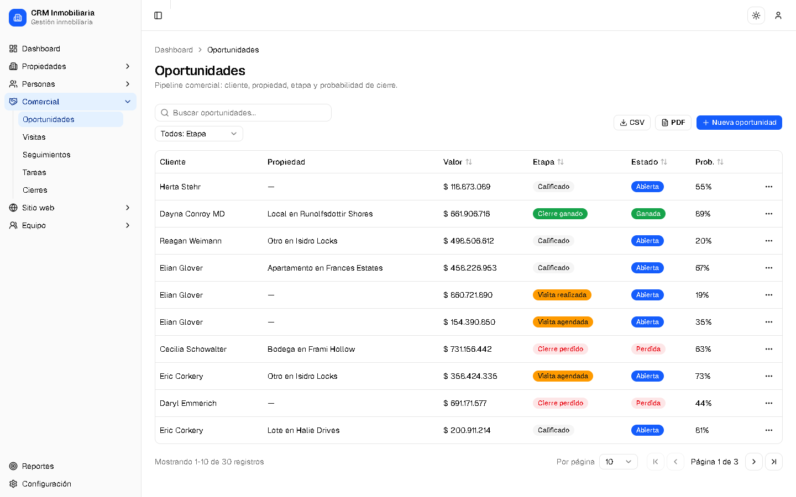

## 24.1 Listar 🟢

Columnas: **Cliente**, **Propiedad**, **Valor**, **Etapa**, **Estado**, **Prob.** (probabilidad %), acciones.

## 24.2 Etapas del pipeline (`stage`)

Nuevo → Contactado → Calificado → Propiedades enviadas → Visita agendada → Visita realizada → Negociación → Cierre ganado / Cierre perdido.

## 24.3 Estado (`status`)

Se calcula **automáticamente** a partir de la etapa: mientras la etapa no sea un cierre, el estado es **"Abierta"**; si la etapa pasa a "Cierre ganado", el estado cambia a **"Ganada"**; si pasa a "Cierre perdido", cambia a **"Perdida"**. No existe un campo de estado editable de forma independiente — se mueve cambiando la etapa.

## 24.4 Filtro 🟢

Dropdown **"Etapa"**.

## 24.5 Crear / editar 🔵

Botón **"Nueva oportunidad"**. Campos: Cliente (obligatorio), Propiedad (opcional — al elegirla, autocompleta el propietario), Etapa (obligatoria), Valor estimado, Probabilidad % (0-100), Próxima acción, Fecha estimada de cierre, Notas.

## 24.6 Eliminar 🔴

Solo Admin.

## 24.7 Exportar 🟢

Botones CSV/PDF (también existe una exportación específica para oportunidades **cerradas**, ver [Capítulo 28 — Cierres](#capítulo-28--cierres)).

\pagebreak

# Capítulo 25 — Visitas

Ruta: `/visits`.

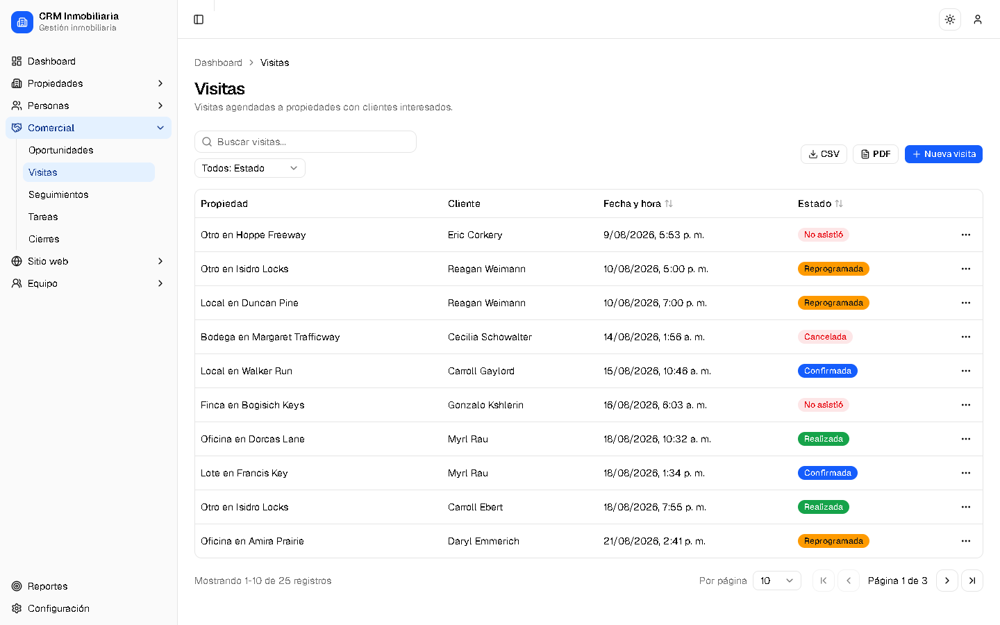

## 25.1 Listar 🟢

Columnas: **Propiedad**, **Cliente**, **Fecha y hora**, **Estado**, acciones.

## 25.2 Estados de una visita

Pendiente, Confirmada, Realizada, Cancelada, Reprogramada, No asistió.

## 25.3 Filtro 🟢

Dropdown **"Estado"**.

## 25.4 Crear una visita 🔵

Botón **"Nueva visita"**. Campos:

| Campo | Obligatorio |
|---|:---:|
| Propiedad | Sí |
| Cliente | Sí |
| Fecha y hora | Sí |
| Estado | Sí (por defecto "Pendiente") |
| Observaciones | No |
| Resultado | No |
| Seguimiento posterior | No |

## 25.5 Registrar resultado y seguimiento

Después de realizada la visita, edite el registro y complete los campos **"Resultado"** y **"Seguimiento posterior"**, y actualice el **Estado** a "Realizada", "Cancelada", "Reprogramada" o "No asistió" según corresponda.

## 25.6 Eliminar 🔴 / Exportar 🟢

Solo Admin elimina; CSV/PDF disponibles para todos los roles.

\pagebreak

# Capítulo 26 — Seguimientos / Actividades

Ruta: `/activities`. Registra el historial de contacto con clientes, leads u oportunidades.

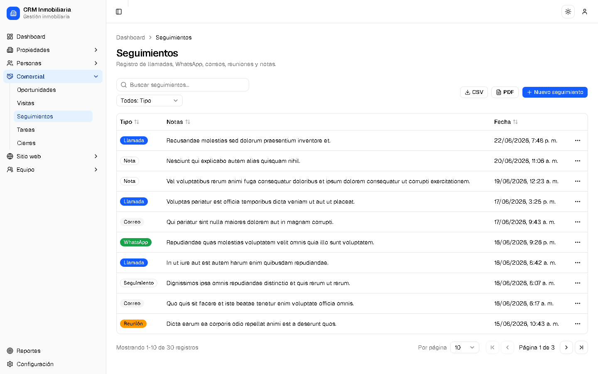

## 26.1 Tipos de seguimiento

Llamada, WhatsApp, Correo, Reunión, Nota, Seguimiento.

## 26.2 Listar 🟢 y filtrar 🟢

Columnas: **Tipo**, **Notas** (resumen), **Fecha**, acciones. Filtro dropdown **"Tipo"**.

## 26.3 Crear 🔵

Botón **"Nuevo seguimiento"**. Campos: Tipo (obligatorio, por defecto "Nota"), Fecha (obligatoria), Notas (obligatorias).

## 26.4 Para qué sirve el historial

El historial de seguimientos permite reconstruir toda la conversación que ha tenido el equipo con un cliente, lead u oportunidad: qué se habló, cuándo y por qué medio, para no repetir gestiones ni perder contexto entre agentes.

## 26.5 Eliminar 🔴 / Exportar 🟢

\pagebreak

# Capítulo 27 — Tareas

Ruta: `/tasks`.

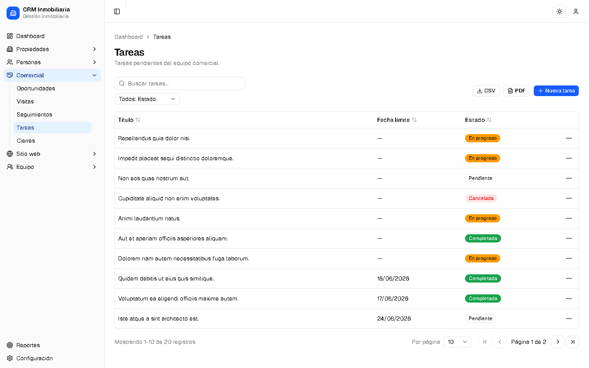

## 27.1 Listar 🟢 y filtrar 🟢

Columnas: **Título**, **Fecha límite**, **Estado**, acciones. Filtro dropdown **"Estado"**.

## 27.2 Estados

Pendiente, En progreso, Completada, Cancelada.

## 27.3 Crear / asignar 🔵

Botón **"Nueva tarea"**. Campos: Título (obligatorio), Fecha límite, Estado (por defecto "Pendiente"), Descripción.

> ⚠️ **Esta función no está disponible en la versión actual:** las tareas **no tienen campo de prioridad**. No existe un indicador visual de "alta/media/baja prioridad" en ningún lugar del sistema.

## 27.4 Completar una tarea

Edite la tarea y cambie su **Estado** a "Completada".

## 27.5 Eliminar 🔴 / Exportar 🟢

\pagebreak

# Capítulo 28 — Cierres

Ruta: `/closings`. **Módulo de solo lectura.**

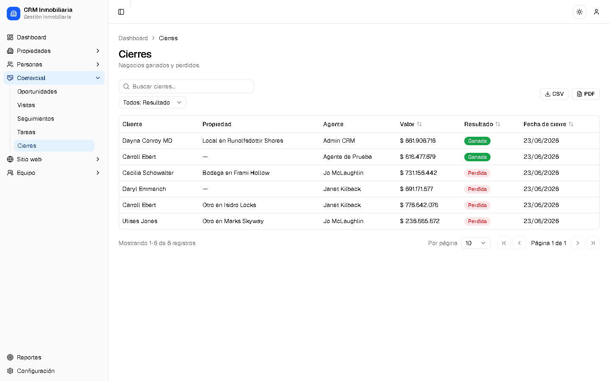

## 28.1 ¿Qué muestra?

No existe un módulo de "Cierre" independiente: esta pantalla es una vista derivada de las **Oportunidades** cuya etapa llegó a "Cierre ganado" o "Cierre perdido" (ver [Capítulo 24](#capítulo-24--oportunidades)). Por eso no tiene botón de crear, ni opciones de editar o eliminar por fila.

## 28.2 Columnas

**Cliente**, **Propiedad**, **Agente**, **Valor**, **Resultado** (Ganada/Perdida), **Fecha de cierre**.

## 28.3 Filtro 🟢

Dropdown **"Resultado"** (Ganada / Perdida).

## 28.4 Exportar 🟢

Botones CSV/PDF, independientes de la exportación general de oportunidades.

\pagebreak

# Capítulo 29 — Documentos

No existe una sección de menú llamada "Documentos" por sí sola. Los documentos se administran **dentro** de la ficha de cada registro, mediante un panel llamado **"Documentos"**.

## 29.1 Dónde aparecen

El panel de documentos está disponible únicamente en la vista de edición de: **Propiedades**, **Propietarios**, **Clientes** y **Oportunidades**.

> ⚠️ **Esta función no está disponible en la versión actual:** Leads, Visitas, Tareas, Seguimientos y Blog **no** tienen panel de documentos adjuntos.

## 29.2 Cargar un documento 🔵

Botón **"Subir documento"**. Formatos permitidos: PDF, JPG, JPEG, PNG, DOC, DOCX, XLS, XLSX, hasta 10 MB.

## 29.3 Descargar 🟢

Cualquier rol puede descargar los documentos ya cargados.

## 29.4 Eliminar 🔴

Solo el rol Administrador puede eliminar un documento.

> ⚠️ **Advertencia:** no cargue en el sistema información que no deba quedar almacenada permanentemente (por ejemplo, documentos con datos personales sensibles que no sean estrictamente necesarios para la gestión comercial o legal del inmueble).

\pagebreak

# Capítulo 30 — Blog desde el CRM

Ruta: `/blog-posts`.

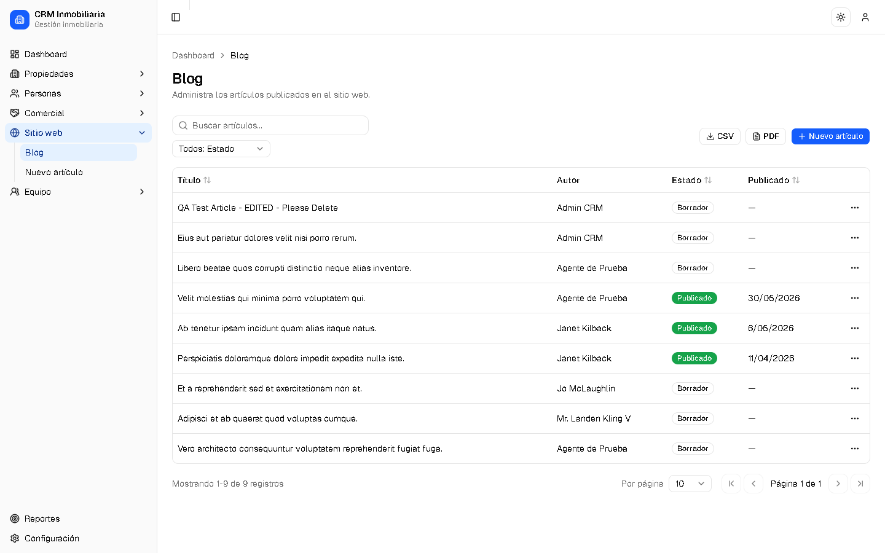

## 30.1 Listar 🟢

Columnas: **Título**, **Autor**, **Estado**, **Publicado** (fecha), acciones. Filtro dropdown **"Estado"** (Borrador/Publicado).

## 30.2 Crear un artículo 🔵

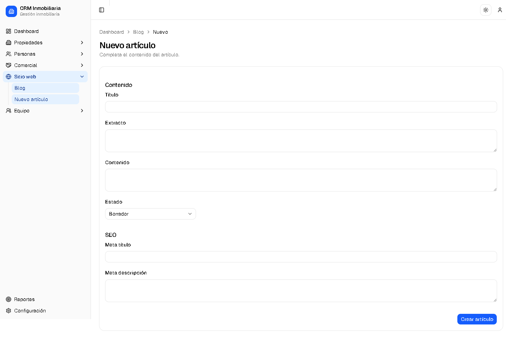

Botón **"Nuevo artículo"**. Campos agrupados:

- **Contenido**: Título (obligatorio), Extracto, Contenido (obligatorio), Estado (Borrador/Publicado).
- **SEO**: Meta título, Meta descripción.

> ⚠️ **Esta función no está disponible en la versión actual, tal como está redactada en el requerimiento:** no es posible cargar la **imagen destacada durante la creación** del artículo. El flujo real es: primero se crea el artículo (sin imagen) y, una vez creado, se abre automáticamente su edición, donde sí aparece la tarjeta **"Portada"** con el botón **"Subir imagen"** / **"Cambiar imagen"**.

## 30.3 Publicar

Al cambiar el **Estado** a "Publicado" y guardar, el sistema fija automáticamente la fecha de publicación al momento actual.

## 30.4 Imagen destacada

Disponible solo en la vista de edición del artículo (no en la de creación), mediante la tarjeta **"Portada"**.

## 30.5 Cómo termina apareciendo en la web pública

Un artículo aparece en `/blog` únicamente cuando su estado es **"Publicado"** y su fecha de publicación ya pasó.

## 30.6 Eliminar 🔴 / Exportar 🟢

\pagebreak

# Capítulo 31 — Usuarios 🔴

Ruta: `/team/users`. **Visible solo para el rol Administrador.**

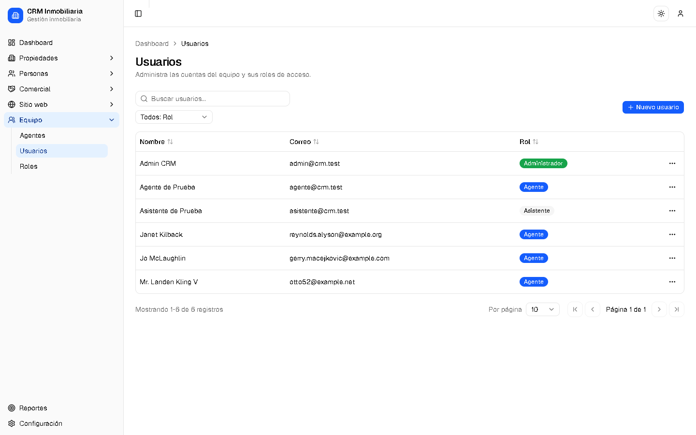

## 31.1 Listar

Columnas: **Nombre**, **Correo**, **Rol** (insignia), acciones. Filtro dropdown **"Rol"** (Administrador/Agente/Asistente).

## 31.2 Crear un usuario

Botón **"Nuevo usuario"**. Campos: Nombre (obligatorio), Correo electrónico (obligatorio, único), Contraseña (obligatoria, mínimo 8 caracteres), Rol (Administrador/Agente/Asistente, por defecto "Agente"). Botón: **"Crear usuario"**.

## 31.3 Editar un usuario

Campos: Nombre, Correo electrónico, Nueva contraseña (opcional — déjela vacía para no cambiarla), Rol. Botón: **"Guardar cambios"**.

## 31.4 Eliminar un usuario

Disponible para cualquier usuario excepto **usted mismo**: el botón "Eliminar" no aparece en la fila correspondiente a su propia cuenta, para evitar que un administrador se elimine a sí mismo accidentalmente.

> ⚠️ **Importante:** aunque no puede eliminarse ni cambiar su propio rol, **sí puede eliminar o cambiar el rol de otros administradores** — el sistema no impide dejar la inmobiliaria sin ningún administrador si hay más de uno y se eliminan entre sí. Gestione estas cuentas con cuidado.

\pagebreak

# Capítulo 32 — Agentes 🔴

Ruta: `/team/agents`. Visible solo para Administrador. **Es una vista de solo lectura**, no un formulario.

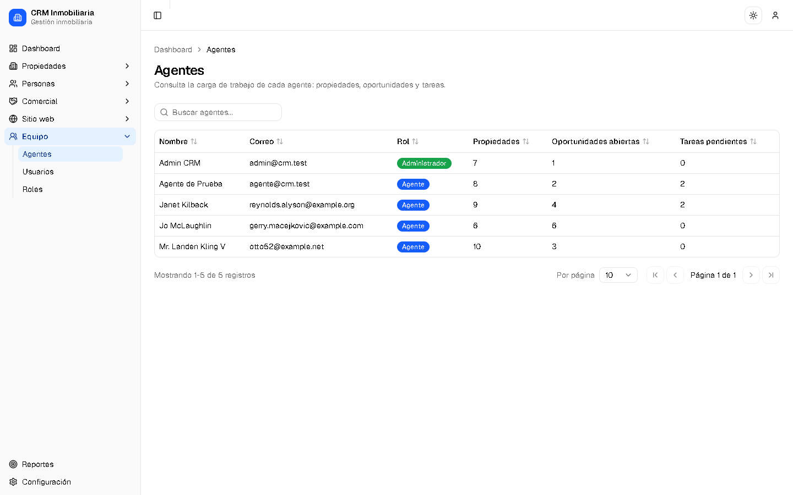

## 32.1 Columnas

**Nombre**, **Correo**, **Rol**, **Propiedades** (cantidad asignada), **Oportunidades abiertas**, **Tareas pendientes**.

## 32.2 Nota

Esta pantalla no tiene botones de crear/editar/eliminar. El mensaje que muestra el propio sistema cuando la lista está vacía lo confirma: *"Los agentes se crean desde la sección Usuarios."* Es decir, un "agente" aquí es simplemente cualquier usuario con rol Admin o Agente — no existe una entidad "Agente" separada de "Usuario".

\pagebreak

# Capítulo 33 — Roles y permisos 🔴

Ruta: `/team/roles`. Visible solo para Administrador. Es una **pantalla informativa**, no un editor: no se pueden modificar permisos desde aquí.

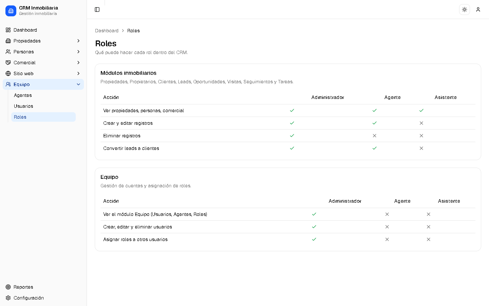

## 33.1 Módulos inmobiliarios

| Permiso | Admin | Agente | Asistente |
|---|:---:|:---:|:---:|
| Ver propiedades, personas, comercial | ✅ | ✅ | ✅ |
| Crear y editar registros | ✅ | ✅ | ❌ |
| Eliminar registros | ✅ | ❌ | ❌ |
| Convertir leads a clientes | ✅ | ✅ | ❌ |

## 33.2 Equipo

| Permiso | Admin | Agente | Asistente |
|---|:---:|:---:|:---:|
| Ver el módulo Equipo (Usuarios, Agentes, Roles) | ✅ | ❌ | ❌ |
| Crear, editar y eliminar usuarios | ✅ | ❌ | ❌ |
| Asignar roles a otros usuarios | ✅ | ❌ | ❌ |

Esta matriz coincide exactamente con el comportamiento real verificado del sistema (ver [Capítulo 2](#capítulo-2--roles-del-sistema)).

\pagebreak

# Capítulo 34 — Reportes 🟢

Ruta: `/reports`. Los tres reportes son de solo lectura, cada uno con su propia tabla y sus propios botones de exportación.

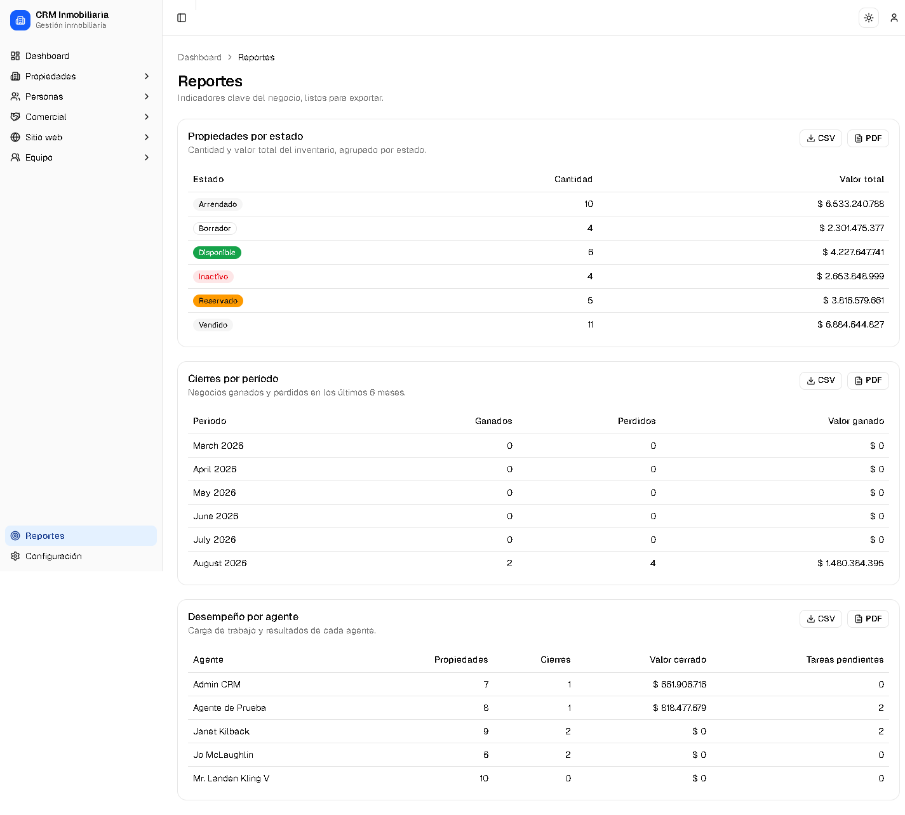

## 34.1 Propiedades por estado

**Qué mide:** cantidad y valor total del inventario, agrupado por estado (Borrador, Disponible, Reservado, Vendido, Arrendado, Inactivo).
**Cuándo usarlo:** para saber cuánto inventario activo tiene la inmobiliaria y su valor total en cada etapa.
**Filtros:** ninguno.
**Cómo interpretarlo:** compare la columna "Cantidad" con "Valor total" para identificar en qué estado se concentra el mayor valor del portafolio.

## 34.2 Cierres por periodo

**Qué mide:** negocios ganados y perdidos de los **últimos 6 meses** (ventana fija).
**Cuándo usarlo:** para evaluar la tendencia reciente de cierre de negocios.
**Filtros:** ninguno visible en la interfaz (el backend admite un parámetro de meses, pero la pantalla actual no expone ese control).
**Cómo interpretarlo:** compare "Ganados" contra "Perdidos" mes a mes, y observe la columna "Valor ganado" para el impacto económico real.

## 34.3 Desempeño de agentes

**Qué mide:** por cada usuario con rol Admin o Agente — propiedades asignadas, cierres totales (ganados + perdidos), valor cerrado (solo ganados) y tareas pendientes.
**Cuándo usarlo:** para revisiones de desempeño individual o repartición de carga de trabajo.
**Filtros:** ninguno.
**Cómo interpretarlo:** un agente con muchas tareas pendientes y pocos cierres puede necesitar apoyo o redistribución de cuentas.

\pagebreak

# Capítulo 35 — Exportaciones 🟢

## 35.1 Formatos disponibles

**CSV** y **PDF**, seleccionables con botones independientes en cada listado.

## 35.2 Procedimiento general

1. Aplique los filtros y/o la búsqueda que necesite.
2. Verifique el resultado en pantalla.
3. Presione el botón **CSV** o **PDF**.
4. El archivo se descarga automáticamente con los resultados filtrados (no solo la página actual).

## 35.3 Dónde existe exportación

| Módulo | CSV | PDF |
|---|:---:|:---:|
| Propiedades | ✅ | ✅ |
| Propietarios | ✅ | ✅ |
| Clientes | ✅ | ✅ |
| Leads | ✅ | ✅ |
| Oportunidades | ✅ | ✅ |
| Cierres (oportunidades cerradas) | ✅ | ✅ |
| Visitas | ✅ | ✅ |
| Seguimientos | ✅ | ✅ |
| Tareas | ✅ | ✅ |
| Blog | ✅ | ✅ |
| Reportes (los 3) | ✅ | ✅ |
| Documentos | ❌ | ❌ |
| Usuarios | ❌ | ❌ |
| Agentes | ❌ | ❌ |

> ⚠️ **Esta función no está disponible en la versión actual:** Documentos, Usuarios y Agentes no tienen botón de exportación.

\pagebreak

# Capítulo 36 — Configuración y perfil 🟢

Ruta: `/settings`.

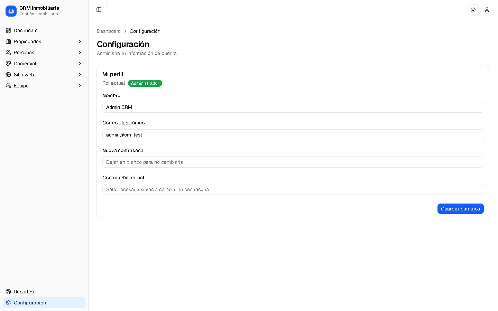

## 36.1 Campos

| Campo | Obligatorio |
|---|:---:|
| Nombre | Sí |
| Correo electrónico | Sí |
| Nueva contraseña | No (déjela vacía para no cambiarla) |
| Contraseña actual | Solo si va a cambiar la contraseña |

La tarjeta también muestra su **rol actual** como insignia (Administrador/Agente/Asistente), sin poder modificarlo usted mismo.

## 36.2 Cambiar la contraseña

1. Ingrese la **nueva contraseña** (mínimo 8 caracteres).
2. Ingrese su **contraseña actual**.
3. Presione **"Guardar cambios"**.

Si deja el campo "Nueva contraseña" vacío, el sistema guarda solo los cambios de nombre/correo y **no** exige la contraseña actual. Si escribe una nueva contraseña pero no indica la actual, verá el error: *"Ingresa tu contraseña actual para poder cambiarla"*.

Confirmación de éxito: **"Perfil actualizado correctamente"**.

\pagebreak

# Parte C — Flujos y referencia

# Capítulo 37 — Flujos completos

## Flujo 1 — Publicar una propiedad

```text
Propietario
 ↓
Crear propietario (Capítulo 20)
 ↓
Crear propiedad y asociarla al propietario (Capítulo 18)
 ↓
Completar ubicación, precio y características
 ↓
Subir fotografías (Capítulo 19)
 ↓
Activar "Publicar en el sitio web" y marcar Estado = Disponible
 ↓
Aparece en /propiedades, /comprar o /arrendar según su tipo
```

## Flujo 2 — Atender un cliente de principio a fin

```text
Lead (Capítulo 22) — nace en la web o se crea manualmente
 ↓
Contacto / seguimiento (Capítulo 26)
 ↓
Convertir a Cliente (Capítulo 23)
 ↓
Crear Oportunidad asociando Cliente + Propiedad (Capítulo 24)
 ↓
Agendar Visita (Capítulo 25)
 ↓
Registrar resultado de la visita
 ↓
Avanzar la etapa de la oportunidad (Negociación...)
 ↓
Cierre — Ganado o Perdido (Capítulo 28)
```

## Flujo 3 — Captar propietario desde la web

```text
Visitante del sitio
 ↓
Página "Vender mi propiedad" (Capítulo 10)
 ↓
Completa el formulario (nombre + correo/teléfono + datos del inmueble)
 ↓
Se crea un Lead en el CRM (origen: Página web)
 ↓
El equipo comercial contacta al propietario (Seguimientos)
 ↓
Si prospera: se crea el Propietario y su Propiedad en el CRM
```

\pagebreak

# Capítulo 38 — Búsqueda, filtros y paginación

## 38.1 En la web pública

- El catálogo (`/propiedades`, `/comprar`, `/arrendar`) usa filtros por tipo, ciudad, precio, habitaciones y baños (ver [Capítulo 5](#capítulo-5--buscar-y-filtrar-propiedades)).
- La paginación no tiene selector de cantidad por página.

## 38.2 En el CRM

- Cada listado tiene un buscador de texto libre y, en la mayoría de los módulos, un filtro adicional por dropdown (estado, etapa, origen, tipo, rol, etc.).
- La paginación del CRM sí incluye selector de tamaño (10/25/50/100 registros).

### Ejemplo práctico

Para encontrar todas las oportunidades en etapa de negociación de un cliente específico:

1. Vaya a **Oportunidades**.
2. En el buscador, escriba el nombre del cliente.
3. En el filtro **"Etapa"**, seleccione **"Negociación"**.
4. Ajuste el tamaño de página si hay muchos resultados.

\pagebreak

# Capítulo 39 — Estados del sistema

## Propiedades (`status`)

Borrador → Disponible → Reservado → Vendido / Arrendado → Inactivo.

> 📌 Solo **Disponible** y **Reservado** son visibles públicamente (y solo si además está publicada y la fecha de publicación ya pasó).

## Tipo de operación (`listing_type`)

Venta, Arriendo.

## Tipo de inmueble (`property_type`)

Apartamento, Casa, Oficina, Local, Lote, Bodega, Finca, Otro.

## Propietarios / Clientes (`status`)

Activo, Inactivo.

## Leads

**Origen:** Página web, WhatsApp, Llamada, Referido, Redes sociales, Portal inmobiliario, Manual, Otro.
**Estado:** Nuevo, Contactado, Calificado, Descartado, Convertido.

## Oportunidades

**Etapa (`stage`):** Nuevo, Contactado, Calificado, Propiedades enviadas, Visita agendada, Visita realizada, Negociación, Cierre ganado, Cierre perdido.
**Estado (`status`, automático):** Abierta, Ganada, Perdida.

## Visitas

Pendiente, Confirmada, Realizada, Cancelada, Reprogramada, No asistió.

## Seguimientos / Actividades (`type`)

Llamada, WhatsApp, Correo, Reunión, Nota, Seguimiento.

## Tareas

Pendiente, En progreso, Completada, Cancelada.

## Blog

Borrador, Publicado.

\pagebreak

# Capítulo 40 — Mensajes del sistema

## 40.1 Éxito

Patrón general: **"{Registro} {creado/actualizado/eliminado} correctamente"**. Ejemplos: *"Propiedad creada correctamente"*, *"Cliente actualizado correctamente"*, *"'{nombre}' eliminado correctamente"*, *"'{nombre}' convertido a cliente"*, *"Perfil actualizado correctamente"*, *"Contraseña actualizada correctamente"*.

## 40.2 Error

Patrón general: **"No fue posible {crear/actualizar/eliminar/cargar} {el/la} {registro}"**. Ejemplos: *"No fue posible eliminar la propiedad"*, *"No fue posible convertir el lead"*, *"No fue posible iniciar sesión"*, *"No fue posible generar el archivo de exportación"*.

## 40.3 Validación

Aparecen debajo de cada campo del formulario. Ejemplos: *"El nombre es obligatorio"*, *"Correo inválido"*, *"La contraseña debe tener al menos 8 caracteres"*, *"Indica al menos un correo o un teléfono de contacto"*, *"El presupuesto máximo debe ser mayor o igual al mínimo"*, *"Ingresa tu contraseña actual para poder cambiarla"*.

## 40.4 Permisos

Cuando un rol sin permiso intenta una acción no disponible en su interfaz, el botón correspondiente **directamente no aparece** en pantalla (no se muestra un mensaje de "no autorizado" al usuario, porque la opción está oculta de antemano).

## 40.5 Confirmación

Antes de eliminar cualquier registro, o de convertir un lead, aparece un cuadro de diálogo de confirmación con el detalle de la acción y un botón para confirmarla o cancelarla.

\pagebreak

# Capítulo 41 — Solución de problemas

| Problema | Posible causa | Qué hacer |
|---|---|---|
| No puedo crear un registro | Su rol es **Asistente**, que no tiene permiso de creación | Solicite a un Admin o Agente que lo cree, o pida que le asignen un rol con permiso de escritura |
| No veo el botón "Eliminar" | Es una restricción de permisos: solo el rol **Administrador** puede eliminar | Solicite a un administrador que elimine el registro |
| Una propiedad no aparece en la web | El interruptor "Publicar en el sitio web" está apagado, o el Estado no es *Disponible*/*Reservado*, o la fecha de publicación es futura | Edite la propiedad, active "Publicar en el sitio web" y verifique el Estado |
| No puedo cambiar mi contraseña | No escribió su **contraseña actual** al intentar establecer una nueva | Complete también el campo "Contraseña actual" en Configuración |
| Un archivo no se puede subir | El tipo de archivo o el tamaño no están permitidos | Para imágenes: use JPG/PNG/WEBP, máx. 5 MB. Para documentos: PDF/JPG/PNG/DOC/DOCX/XLS/XLSX, máx. 10 MB |
| No puedo convertir un lead | El lead ya fue convertido anteriormente, o su rol es Asistente | Verifique el estado del lead; si ya está "Convertido", no es necesario volver a hacerlo |
| No veo el módulo "Equipo" | Su rol no es Administrador | Este módulo (Usuarios, Agentes, Roles) es exclusivo del rol Admin |
| Olvidé mi contraseña | — | Use "¿Olvidaste tu contraseña?" en el login (Capítulo 16) |
| El enlace de recuperación no funciona | El enlace expiró (validez de 60 minutos) o ya fue usado | Solicite un nuevo enlace desde "¿Olvidaste tu contraseña?" |
| No encuentro una propiedad/cliente en el listado | Hay un filtro activo que lo está ocultando | Revise los filtros aplicados o límpielos antes de buscar |

\pagebreak

# Capítulo 42 — Preguntas frecuentes

**¿Cómo publico una propiedad?**
Cree o edite la propiedad, active el interruptor "Publicar en el sitio web" y asegúrese de que su Estado sea "Disponible" o "Reservado". Ver [Capítulo 18](#capítulo-18--propiedades).

**¿Cómo marco una propiedad como destacada?**
Dentro del formulario de edición de la propiedad, active el interruptor "Propiedad destacada".

**¿Cómo convierto un lead?**
Desde `/leads`, use el botón "Convertir a cliente" en el lead correspondiente. Ver [Capítulo 23](#capítulo-23--convertir-un-lead-en-cliente).

**¿Cómo agendo una visita?**
Desde `/visits`, presione "Nueva visita" y complete propiedad, cliente y fecha/hora. Ver [Capítulo 25](#capítulo-25--visitas).

**¿Qué diferencia hay entre cliente y lead?**
Un lead es un interesado que aún no se ha calificado ni convertido; un cliente es un registro ya confirmado con el que se puede trabajar oportunidades comerciales formalmente.

**¿Quién puede eliminar registros?**
Únicamente el rol **Administrador**.

**¿Cómo exporto información?**
Aplique los filtros que necesite en el listado y presione el botón **CSV** o **PDF**. Ver [Capítulo 35](#capítulo-35--exportaciones).

**¿Cómo cambio mi contraseña?**
Vaya a Configuración, escriba la nueva contraseña y su contraseña actual, y presione "Guardar cambios". Ver [Capítulo 36](#capítulo-36--configuración-y-perfil).

**¿Cómo publico un artículo del blog?**
Cree el artículo, guárdelo, y en su edición cambie el Estado a "Publicado" y suba la imagen de portada. Ver [Capítulo 30](#capítulo-30--blog-desde-el-crm).

**¿Por qué una propiedad no aparece públicamente?**
Revise que esté publicada, en estado Disponible o Reservado, y que la fecha de publicación no sea futura. Ver [Capítulo 41](#capítulo-41--solución-de-problemas).

\pagebreak

# Capítulo 43 — Buenas prácticas

- Mantenga la información de propiedades, propietarios y clientes actualizada; los datos desactualizados generan errores de atención al cliente.
- Revise cuidadosamente los datos de una propiedad **antes** de activar "Publicar en el sitio web": lo que ve el visitante es exactamente lo que se cargó.
- Use los estados correctamente (por ejemplo, marque una propiedad como "Vendida" o "Arrendada" tan pronto se cierre el negocio, para no seguir mostrándola disponible).
- Registre siempre un seguimiento después de cada contacto con un cliente o lead — es la única forma de que el resto del equipo tenga contexto.
- Cierre las tareas cuando estén completadas para mantener el tablero de trabajo limpio y confiable.
- Registre el resultado real de cada visita (realizada, no asistió, reprogramada) apenas ocurra.
- No comparta su usuario y contraseña con otro miembro del equipo: cada persona debe tener su propia cuenta, con el rol que corresponda a su función.
- Mantenga su contraseña segura y cámbiela periódicamente desde Configuración.
- Revise la información filtrada en pantalla antes de exportarla, ya que el archivo exportado refleja exactamente los filtros aplicados.
- Al eliminar un usuario administrador, verifique primero que quede al menos otro administrador activo en el sistema — el sistema no lo hace por usted.

\pagebreak

# Capítulo 44 — Glosario

| Término | Significado |
|---|---|
| **Lead** | Persona que ha mostrado interés pero aún no se ha convertido en cliente. |
| **Cliente** | Persona con la que ya se trabaja comercialmente de forma confirmada. |
| **Propietario** | Persona dueña de un inmueble gestionado por la inmobiliaria. |
| **Oportunidad** | Un posible negocio comercial entre un cliente y (opcionalmente) una propiedad específica. |
| **Pipeline** | El conjunto de oportunidades abiertas, organizadas por etapa. |
| **Cierre** | Una oportunidad que llegó a su etapa final: ganada o perdida. |
| **Propiedad destacada** | Propiedad marcada para aparecer en la sección principal del sitio web. |
| **Publicación** | Acción de hacer visible una propiedad o artículo de blog en el sitio público. |
| **Visita** | Encuentro agendado entre un cliente y una propiedad, con un agente presente. |
| **Seguimiento** | Registro de un contacto realizado (llamada, WhatsApp, correo, reunión, nota). |
| **Agente** | Usuario del CRM con rol "Agente" o "Admin" que gestiona propiedades y clientes. |
| **CRM** | Sistema privado de administración y operación de la inmobiliaria. |

\pagebreak

# Capítulo 45 — Soporte

> 📌 **Placeholder — completar con los datos reales de soporte de la inmobiliaria antes de entregar este manual al cliente final.**

| Canal | Dato |
|---|---|
| Correo de soporte | `[correo-de-soporte-pendiente]` |
| Teléfono de soporte | `[teléfono-de-soporte-pendiente]` |
| Horario de atención | `[horario-pendiente]` |

\pagebreak

# Anexo A — Arquitectura general del sistema

Este anexo es de alto nivel, únicamente para dar contexto técnico general. No sustituye ni forma parte del manual de usuario.

```text
                 ┌───────────────────┐
                 │   Sitio web        │
                 │   (público)        │
                 └─────────┬─────────┘
                           │
                 ┌─────────▼─────────┐
                 │   Sistema          │
                 │   (API central)    │
                 └─────────┬─────────┘
                           │
                 ┌─────────▼─────────┐
                 │   CRM              │
                 │   (privado)        │
                 └───────────────────┘
```

El sitio web público y el CRM privado comparten la misma base de datos a través de un sistema central: lo que se crea o modifica en el CRM se refleja en el sitio web público (y viceversa, en el caso de los formularios que generan leads).

