# Manual de Usuario

# Sistema Inmobiliario

**Sitio Web Público + CRM Inmobiliario**

Producto: **CRM Inmobiliaria / Inmobiliaria Prime**  
Versión del manual: **1.0**  
Fecha: **24 de agosto de 2026**  
Estado: **Documento de usuario final**  
Audiencia: **administradores, agentes, asistentes y personal operativo**


---

## Control del documento

| Campo | Detalle |
| --- | --- |
| Nombre del sistema | CRM Inmobiliaria |
| Documento | Manual de Usuario |
| Alcance | Sitio web público y CRM privado |
| Versión | 1.0 |
| Fecha | 24 de agosto de 2026 |
| Estado | Listo para uso operativo |
| Audiencia | Administradores, agentes inmobiliarios, asistentes y usuarios operativos |

> **Nota importante:** este manual está dirigido a usuarios del sistema. No requiere conocimientos de programación, APIs, bases de datos ni arquitectura técnica.

---

## Índice

1. Introducción  
2. Roles del sistema  
3. Inicio del sitio web público  
4. Catálogo de propiedades  
5. Buscar y filtrar propiedades  
6. Propiedades en venta  
7. Propiedades en arriendo  
8. Detalle de propiedad  
9. Solicitar información  
10. Vender mi propiedad  
11. Contacto  
12. Nosotros  
13. Blog público  
14. WhatsApp  
15. Acceso al CRM  
16. Recuperar contraseña  
17. Dashboard  
18. Propiedades  
19. Imágenes de propiedades  
20. Propietarios  
21. Clientes  
22. Leads  
23. Convertir un lead en cliente  
24. Oportunidades  
25. Visitas  
26. Seguimientos / actividades  
27. Tareas  
28. Cierres  
29. Documentos  
30. Blog desde el CRM  
31. Usuarios  
32. Agentes  
33. Roles y permisos  
34. Reportes  
35. Exportaciones  
36. Configuración y perfil  
37. Flujos completos  
38. Búsqueda, filtros y paginación  
39. Estados del sistema  
40. Mensajes del sistema  
41. Solución de problemas  
42. Preguntas frecuentes  
43. Buenas prácticas  
44. Glosario  
45. Soporte  
46. Anexo: arquitectura general del sistema  

---

# Capítulo 1 - Introducción

## 1.1 ¿Qué es el sistema?

El sistema inmobiliario está compuesto por dos partes conectadas:

### Sitio web público

Es la cara comercial de la inmobiliaria. Permite que visitantes externos:

- conozcan la empresa;
- consulten propiedades publicadas;
- filtren propiedades por intención, tipo, ciudad, precio, habitaciones y baños;
- revisen detalles de cada inmueble;
- soliciten información;
- envíen datos para vender o arrendar su propiedad;
- contacten a la inmobiliaria por formulario o WhatsApp;
- lean artículos del blog.

### CRM privado

Es la herramienta interna de operación. Permite que el equipo:

- administre propiedades, propietarios, clientes y leads;
- gestione oportunidades comerciales;
- agende visitas;
- registre seguimientos;
- cree tareas;
- consulte cierres;
- cargue documentos;
- publique artículos;
- revise reportes;
- administre usuarios y roles.

## 1.2 Relación entre web pública y CRM

La relación central es sencilla:

```text
CRM
↓
Se crea una propiedad
↓
Se marca como publicada
↓
Aparece en la página web
↓
Un visitante solicita información
↓
Se registra un lead
↓
El equipo comercial hace seguimiento desde el CRM
```

> **Resultado esperado:** el CRM alimenta la web pública y la web pública ayuda a generar oportunidades comerciales para el CRM.

---

# Capítulo 2 - Roles del sistema

El sistema tiene tres roles reales:

- **Administrador**
- **Agente**
- **Asistente**

La matriz de permisos implementada indica:

| Función | Admin | Agente | Asistente |
| --- | --- | --- | --- |
| Ver propiedades, personas y módulos comerciales | Sí | Sí | Sí |
| Crear registros | Sí | Sí | No |
| Editar registros | Sí | Sí | No |
| Eliminar registros | Sí | No | No |
| Convertir leads a clientes | Sí | Sí | No |
| Ver módulo Equipo | Sí | No | No |
| Crear, editar o eliminar usuarios | Sí | No | No |
| Asignar roles | Sí | No | No |

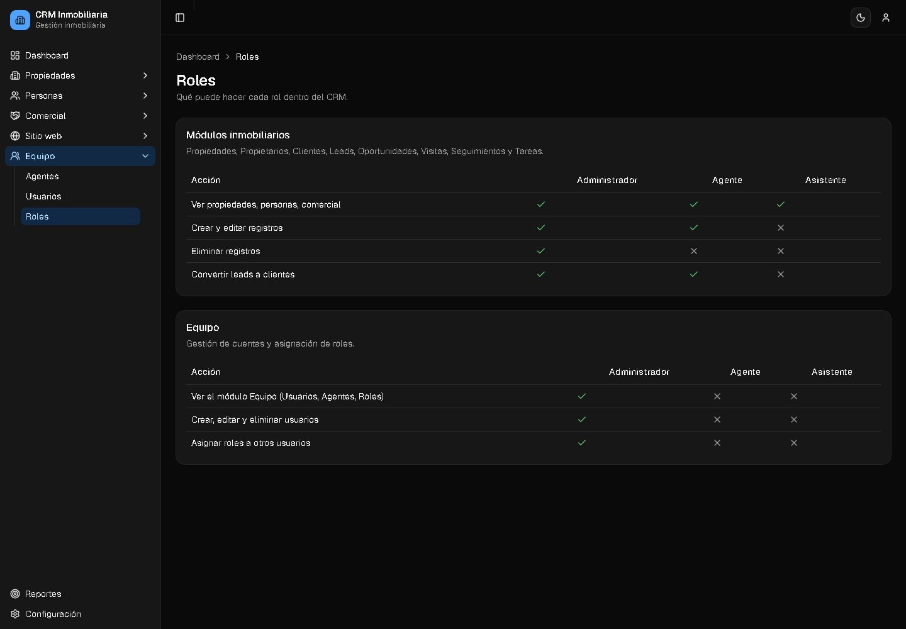

## 2.1 Administrador

El administrador tiene el mayor nivel de acceso. Puede ver, crear, editar y eliminar registros. También puede administrar usuarios, agentes y roles.

Use este rol para personal con responsabilidad de configuración, supervisión y control general.

## 2.2 Agente

El agente puede trabajar comercialmente con registros inmobiliarios: crear y editar propiedades, clientes, leads, oportunidades, visitas, actividades y tareas. No puede eliminar registros ni administrar usuarios.

Use este rol para asesores inmobiliarios y vendedores.

## 2.3 Asistente

El asistente tiene acceso principalmente de consulta. Puede ver la información operativa, pero no crear, editar ni eliminar registros.

Use este rol para personal que necesita revisar datos sin modificar la operación.

> **Advertencia:** si un usuario no ve un botón como “Nuevo”, “Editar” o “Eliminar”, puede deberse a su rol.

---

# Parte A - Sitio web público

# Capítulo 3 - Inicio

La página de inicio es la entrada principal para visitantes. Presenta la identidad de la inmobiliaria, accesos a compra/arriendo, propiedades destacadas, secciones de confianza y llamados a la acción.

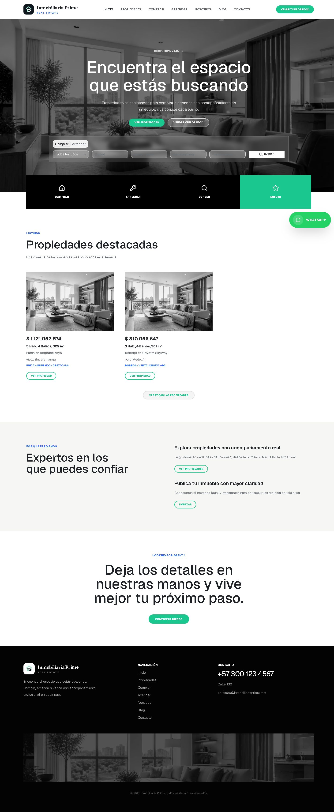

## 3.1 ¿Qué puede hacer un visitante desde aquí?

Desde el inicio puede:

1. Abrir el catálogo de propiedades.
2. Buscar propiedades por intención, tipo, ciudad, zona y precio.
3. Entrar a páginas de compra o arriendo.
4. Consultar propiedades destacadas.
5. Ir a “Vende tu propiedad”.
6. Contactar por WhatsApp mediante el botón flotante.
7. Abrir el menú de navegación.

## 3.2 Elementos principales

- **Logo:** lleva al inicio.
- **Menú principal:** Inicio, Propiedades, Comprar, Arrendar, Nosotros, Blog y Contacto.
- **Botón “Vende tu propiedad”:** dirige al formulario de propietarios.
- **Buscador destacado:** permite iniciar una búsqueda desde el home.
- **Botón flotante de WhatsApp:** visible en toda la web pública.

> **Consejo:** si un visitante no sabe si desea comprar o arrendar, puede iniciar desde el catálogo general y ajustar filtros después.

---

# Capítulo 4 - Catálogo de propiedades

El catálogo reúne las propiedades publicadas en la web.

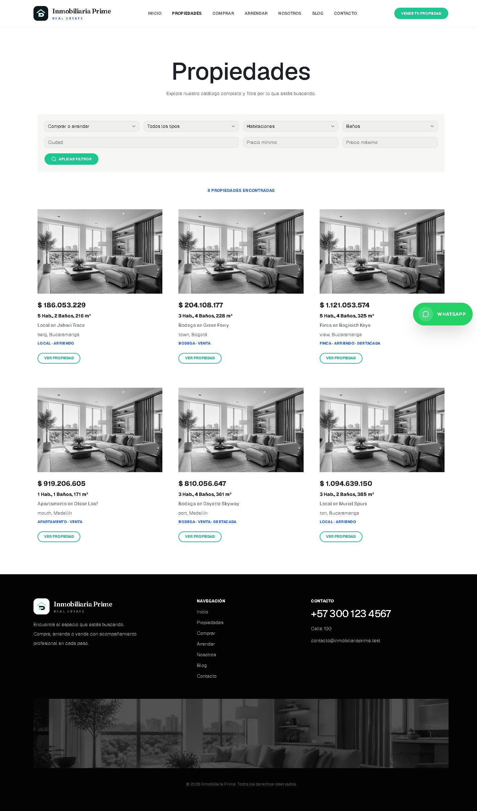

## 4.1 Cómo entrar

Desde el menú superior seleccione **Propiedades**.

## 4.2 Qué muestra cada tarjeta

Cada tarjeta de propiedad puede mostrar:

- imagen o imagen de ejemplo;
- tipo de operación: venta o arriendo;
- si es destacada;
- título;
- ciudad y zona;
- precio;
- características como habitaciones, baños, parqueaderos y área;
- enlace al detalle.

## 4.3 Paginación

Si hay más propiedades que las visibles en una página, el catálogo muestra controles de paginación para avanzar o retroceder.

> **Resultado esperado:** al abrir una propiedad se carga la página de detalle con información más completa.

---

# Capítulo 5 - Buscar y filtrar propiedades

El sistema permite filtrar propiedades públicas con controles reales de búsqueda.

## 5.1 Filtros disponibles

En el catálogo público se encuentran estos filtros:

| Filtro | Uso |
| --- | --- |
| Comprar o arrendar | Define si el visitante busca venta o arriendo |
| Tipo de inmueble | Apartamento, casa, oficina, local, lote, bodega, finca u otro |
| Habitaciones | Filtra por número mínimo de habitaciones |
| Baños | Filtra por número mínimo de baños |
| Ciudad | Filtra por ciudad |
| Precio mínimo | Define presupuesto mínimo |
| Precio máximo | Define presupuesto máximo |

## 5.2 Paso a paso

1. Abra **Propiedades**.
2. Seleccione **Comprar o arrendar**.
3. Seleccione el **tipo de inmueble**.
4. Si aplica, indique **habitaciones** y **baños**.
5. Escriba la **ciudad**.
6. Ingrese **precio mínimo** y/o **precio máximo**.
7. Revise los resultados actualizados.

> **Nota:** en el home también existe un buscador inicial con intención, tipo de inmueble, ciudad, barrio/zona y rango de precio.

---

# Capítulo 6 - Propiedades en venta

La página **Comprar** muestra propiedades enfocadas en venta.

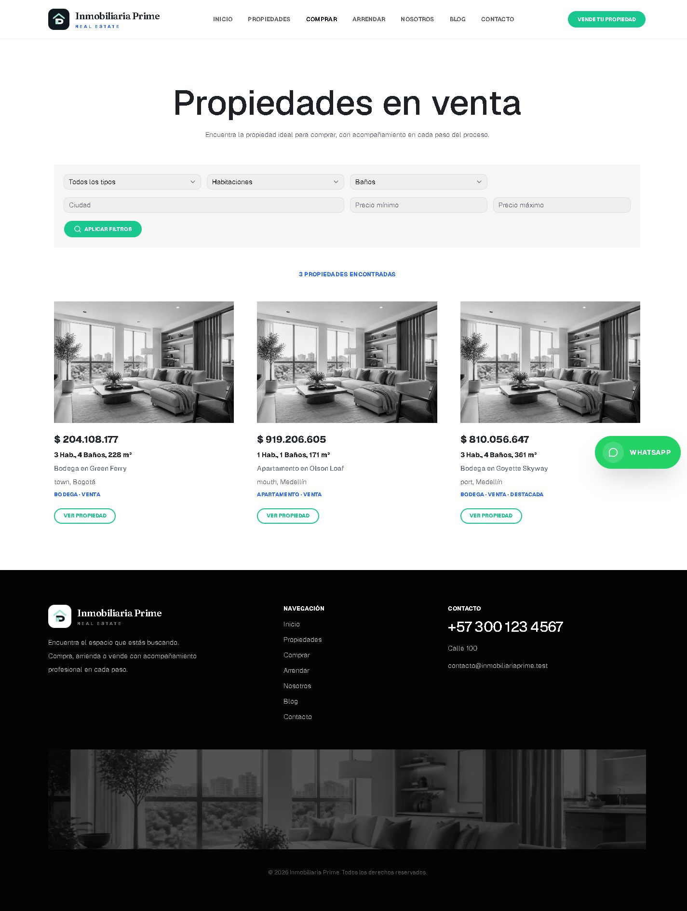

## 6.1 Diferencia con el catálogo general

El catálogo general puede incluir venta y arriendo. La página **Comprar** orienta la búsqueda hacia inmuebles disponibles para compra.

## 6.2 Cuándo usarla

Use esta página cuando el visitante ya sabe que desea comprar.

---

# Capítulo 7 - Propiedades en arriendo

La página **Arrendar** muestra propiedades enfocadas en arriendo.


## 7.1 Cuándo usarla

Use esta página cuando el visitante busca inmuebles para alquilar o arrendar.

---

# Capítulo 8 - Detalle de propiedad

El detalle de propiedad es una de las pantallas más importantes de la web pública.

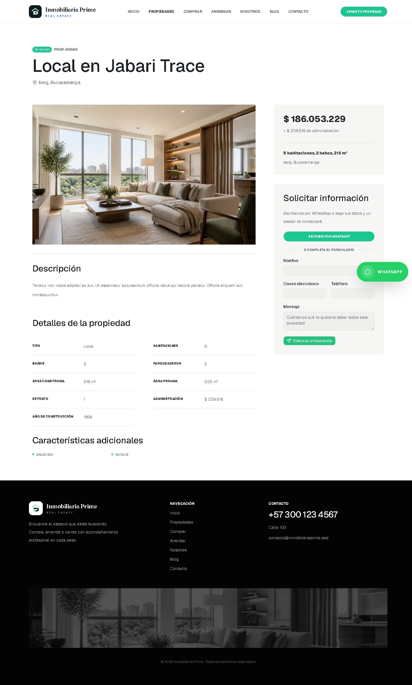

## 8.1 Información visible

La pantalla puede mostrar:

- título;
- código;
- tipo de operación;
- precio;
- ciudad;
- zona;
- dirección si está publicada;
- galería;
- habitaciones;
- baños;
- parqueaderos;
- áreas;
- descripción;
- características;
- formulario de solicitud;
- acción de WhatsApp.

## 8.2 Ver fotografías

La galería permite revisar las imágenes públicas de la propiedad. Si una propiedad no tiene foto, se muestra una imagen de ejemplo.

## 8.3 Revisar características

Las características ayudan al visitante a decidir si el inmueble se ajusta a lo que busca.

## 8.4 Solicitar información

El formulario permite enviar datos para que el equipo comercial contacte al visitante.

## 8.5 Contactar por WhatsApp

La propiedad también puede incluir una acción de WhatsApp con mensaje relacionado al inmueble.

---

# Capítulo 9 - Solicitar información

En el detalle de propiedad se encuentra el formulario **Solicitar información**.

## 9.1 Campos reales

El formulario solicita:

- **Nombre**
- **Correo electrónico**
- **Teléfono**
- **Mensaje**

## 9.2 Cómo usarlo

1. Abra una propiedad.
2. Complete los datos solicitados.
3. Escriba un mensaje si desea agregar contexto.
4. Presione **Solicitar información**.

## 9.3 Qué ocurre después

La solicitud se registra como lead público para que el equipo comercial pueda hacer seguimiento desde el CRM.

> **Nota:** el formulario crea una intención de contacto; la venta o arriendo no se confirma automáticamente.

---

# Capítulo 10 - Vender mi propiedad

La página **Vender mi propiedad** está diseñada para captar propietarios interesados en vender o arrendar.

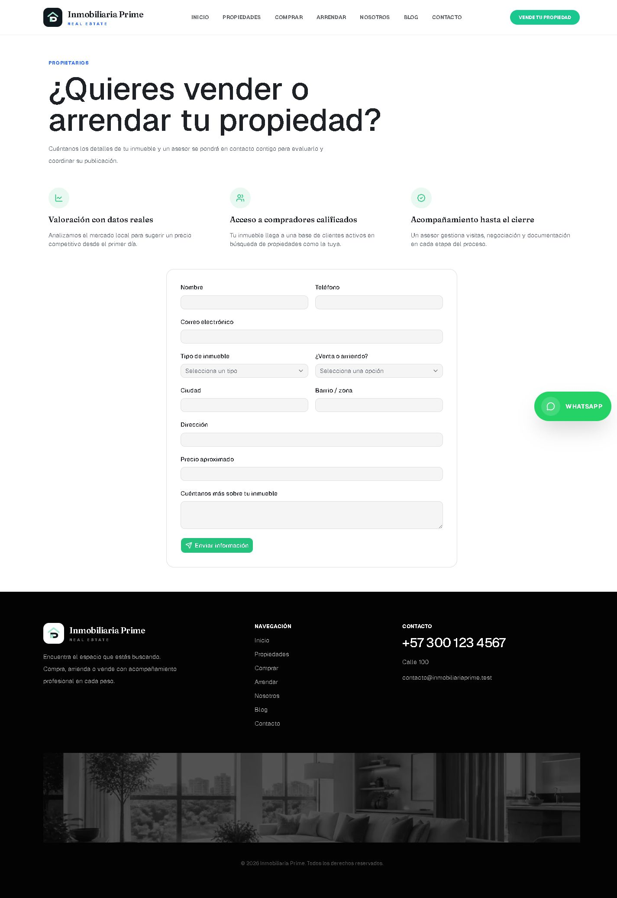

## 10.1 Objetivo

Permitir que un propietario envíe los datos básicos de su inmueble para que la inmobiliaria pueda contactarlo.

## 10.2 Campos reales

El formulario solicita:

- **Nombre**
- **Teléfono**
- **Correo electrónico**
- **Tipo de inmueble**
- **¿Venta o arriendo?**
- **Ciudad**
- **Barrio / zona**
- **Dirección**
- **Precio aproximado**
- **Cuéntanos más sobre tu inmueble**

## 10.3 Paso a paso

1. Presione **Vende tu propiedad** en el menú o desde el home.
2. Complete los datos personales.
3. Seleccione el tipo de inmueble.
4. Indique si busca vender o arrendar.
5. Complete ubicación y precio aproximado.
6. Agregue información adicional.
7. Envíe el formulario.

## 10.4 Resultado esperado

La información se registra para seguimiento comercial. El equipo puede contactar al propietario y avanzar con la captación.

---

# Capítulo 11 - Contacto

La página **Contacto** concentra los canales de comunicación.

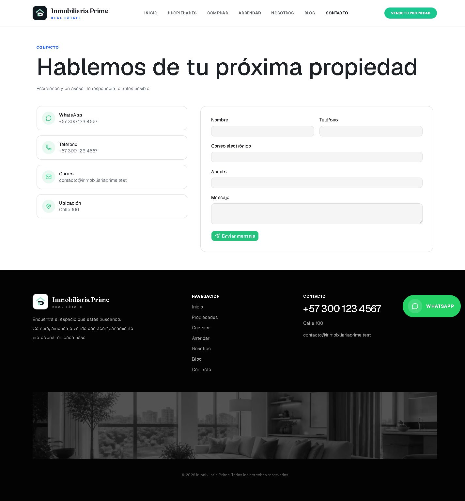

## 11.1 Información visible

La página muestra:

- WhatsApp/teléfono;
- teléfono;
- correo;
- dirección;
- formulario de contacto.

## 11.2 Campos del formulario

- **Nombre**
- **Teléfono**
- **Correo electrónico**
- **Asunto**
- **Mensaje**

## 11.3 Cuándo usarlo

Use esta página para consultas generales que no estén asociadas necesariamente a una propiedad específica.

---

# Capítulo 12 - Nosotros

La página **Nosotros** explica la propuesta de valor de la inmobiliaria.

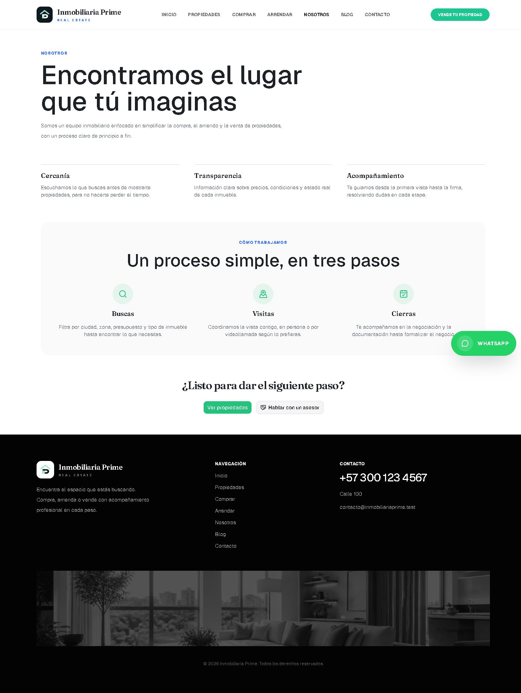

## 12.1 Propósito

Ayuda a que visitantes nuevos entiendan cómo trabaja la inmobiliaria, sus valores y su proceso de acompañamiento.

---

# Capítulo 13 - Blog

El blog público permite publicar contenido útil para compradores, arrendatarios y propietarios.

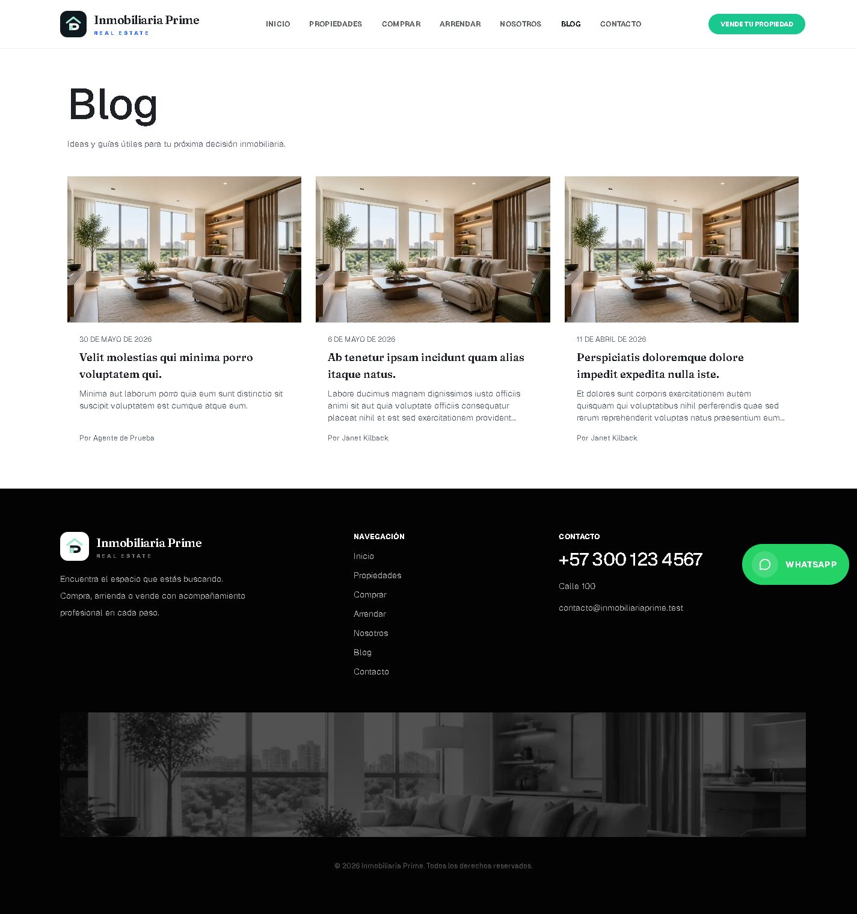

## 13.1 Listado de artículos

Cada artículo puede mostrar:

- imagen destacada;
- fecha de publicación;
- autor si existe;
- título;
- extracto;
- enlace al detalle.

## 13.2 Abrir un artículo

Seleccione una tarjeta del blog para ver el contenido completo.

> **Resultado esperado:** solo los artículos publicados desde el CRM aparecen en la web pública.

---

# Capítulo 14 - WhatsApp

El sitio público tiene un botón flotante de WhatsApp visible en todas las páginas.

## 14.1 Cómo usarlo

1. Presione el botón flotante **WhatsApp**.
2. Se abre WhatsApp en una nueva pestaña o aplicación.
3. El mensaje puede aparecer prellenado.
4. El visitante puede editar el mensaje antes de enviarlo.

## 14.2 Comportamiento real

El botón usa el número configurado para el sitio y un mensaje inicial de solicitud de información sobre propiedades.

---

# Parte B - CRM inmobiliario

# Capítulo 15 - Acceso al CRM

El CRM privado requiere iniciar sesión.

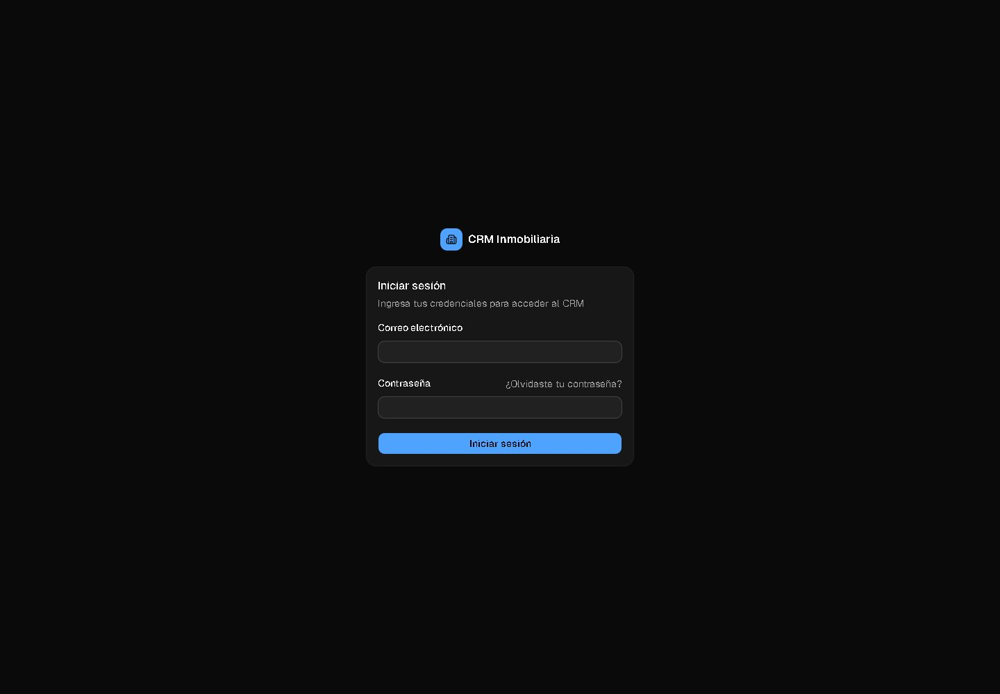

## 15.1 Campos reales

- **Correo electrónico**
- **Contraseña**

## 15.2 Paso a paso

1. Abra `/login`.
2. Ingrese el correo.
3. Ingrese la contraseña.
4. Presione **Iniciar sesión**.

## 15.3 Resultado esperado

Si las credenciales son correctas, el sistema abre el dashboard.

---

# Capítulo 16 - Recuperar contraseña

El sistema incluye flujo de recuperación y reseteo de contraseña.

## 16.1 Olvidé mi contraseña

La pantalla de recuperación solicita:

- **Correo electrónico**

## 16.2 Restablecer contraseña

La pantalla de reseteo solicita:

- **Nueva contraseña**
- **Confirmar contraseña**

> **Nota:** el envío real depende de la configuración de correo del backend. En desarrollo puede estar configurado para registrar correos en logs.

---

# Capítulo 17 - Dashboard

El dashboard presenta un resumen operativo del CRM.

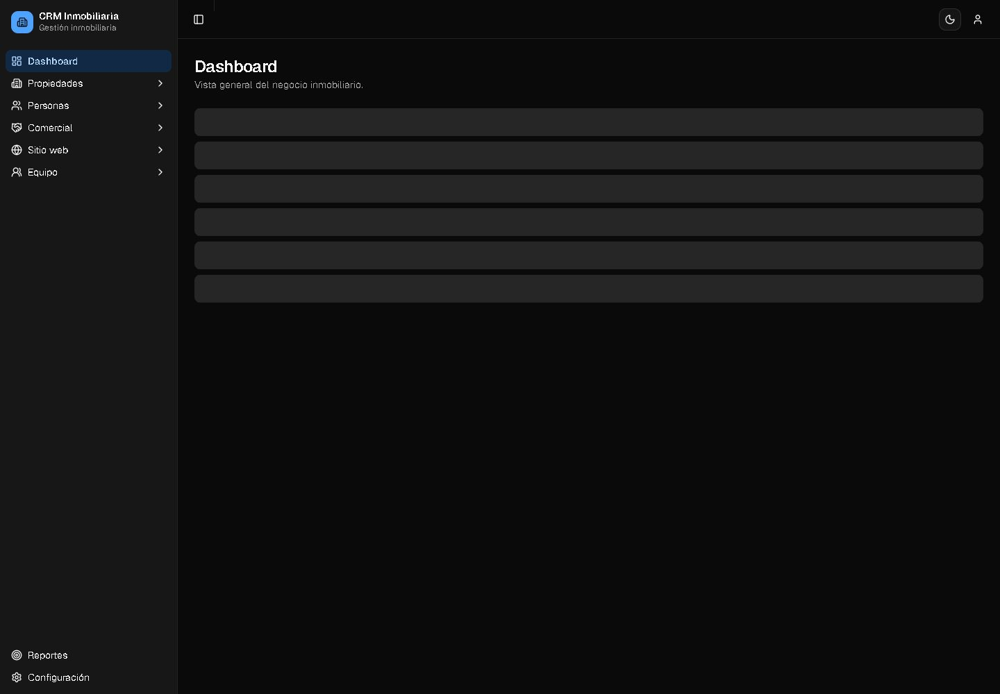

## 17.1 Métricas documentadas

El dashboard consulta indicadores de:

- propiedades activas;
- propiedades disponibles;
- propiedades reservadas;
- propiedades vendidas;
- propiedades arrendadas;
- leads nuevos;
- clientes activos;
- visitas de hoy;
- visitas próximas;
- oportunidades abiertas;
- negocios en negociación;
- cierres del mes;
- tareas pendientes;
- valor potencial.

## 17.2 Cuándo usarlo

Use el dashboard al iniciar el día para revisar el estado general de la operación.

---

# Capítulo 18 - Propiedades

El módulo **Propiedades** administra los inmuebles de la inmobiliaria.

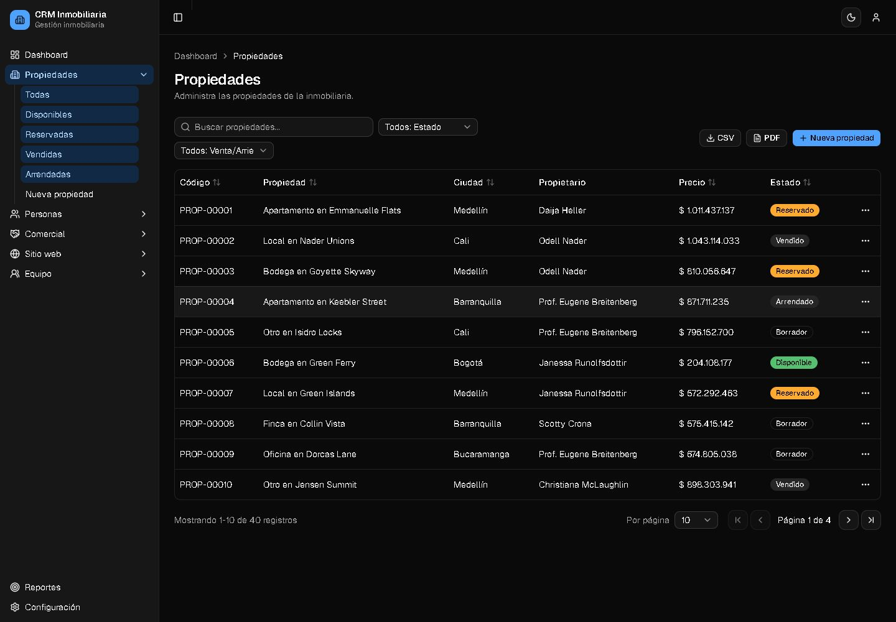

## 18.1 Funciones disponibles

- Listar propiedades.
- Buscar propiedades.
- Filtrar por estado.
- Filtrar por venta/arriendo.
- Exportar CSV.
- Exportar PDF.
- Crear nueva propiedad.
- Editar propiedad.
- Eliminar propiedad si el rol lo permite.

## 18.2 Campos de una propiedad

En el formulario real aparecen:

- **Título**
- **Descripción**
- **Tipo**
- **Venta/Arriendo**
- **Estado**
- **Código**
- **Propietario**
- **Ciudad**
- **Barrio / Zona**
- **Dirección**
- **Precio**
- **Administración**
- **Estrato**
- **Habitaciones**
- **Baños**
- **Parqueaderos**
- **Área construida (m²)**
- **Área privada (m²)**
- **Año de construcción**
- **Observaciones**
- **Publicar en el sitio web**
- **Propiedad destacada**

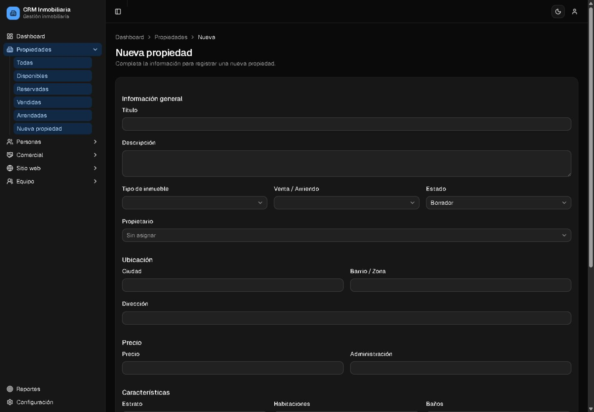

## 18.3 Crear una propiedad - tutorial

1. Abra **Propiedades**.
2. Presione **Nueva propiedad**.
3. Complete **Título** y **Descripción**.
4. Seleccione **Tipo**.
5. Seleccione **Venta/Arriendo**.
6. Seleccione **Estado**.
7. Ingrese el **Código**.
8. Asigne propietario si corresponde.
9. Complete ciudad, zona y dirección.
10. Ingrese precio y administración si aplica.
11. Complete características físicas.
12. Active **Publicar en el sitio web** si debe aparecer públicamente.
13. Active **Propiedad destacada** si debe mostrarse en la sección destacada del inicio.
14. Presione **Crear propiedad**.

## 18.4 Publicar o despublicar

La opción **Publicar en el sitio web** controla si la propiedad aparece en el catálogo público.

> **Importante:** solo las propiedades publicadas aparecen en la web pública.

## 18.5 Destacar propiedad

La opción **Propiedad destacada** permite que la propiedad aparezca en la sección de destacadas del inicio.

---

# Capítulo 19 - Imágenes de propiedades

Las imágenes se gestionan desde la pantalla de edición de una propiedad.

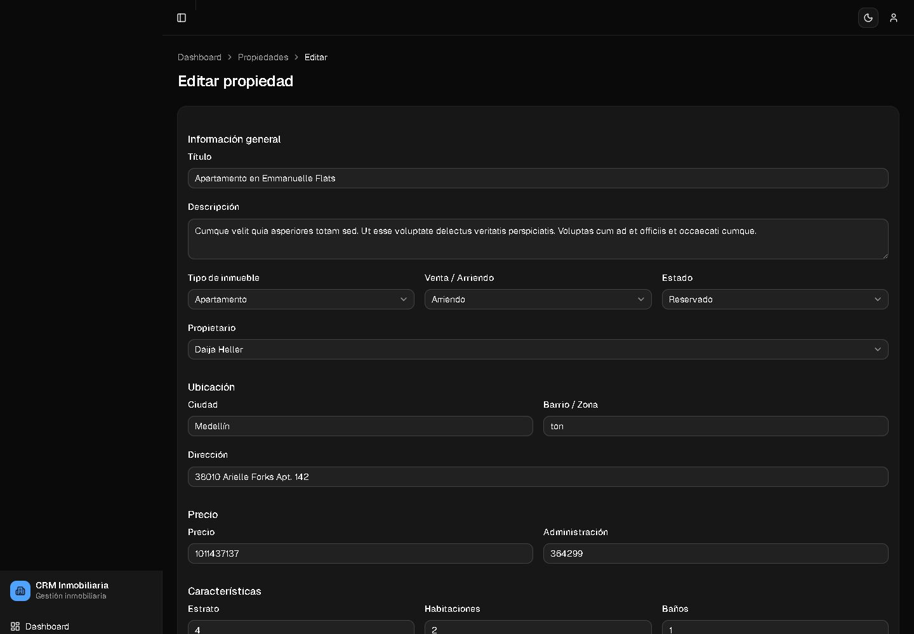

## 19.1 Funciones reales

En la sección **Fotos** aparecen:

- **Subir foto**
- indicador **Portada**
- acciones sobre imágenes cargadas

## 19.2 Cómo subir una foto

1. Abra una propiedad existente.
2. Entre a **Editar**.
3. Busque la sección **Fotos**.
4. Presione **Subir foto**.
5. Seleccione el archivo.

## 19.3 Imagen principal

El sistema identifica una imagen como **Portada**. Esa imagen se utiliza como referencia principal de la propiedad.

> **Nota:** si una propiedad no tiene imágenes, la web pública puede mostrar una imagen de ejemplo.

---

# Capítulo 20 - Propietarios

El módulo **Propietarios** administra personas que entregan inmuebles para venta o arriendo.

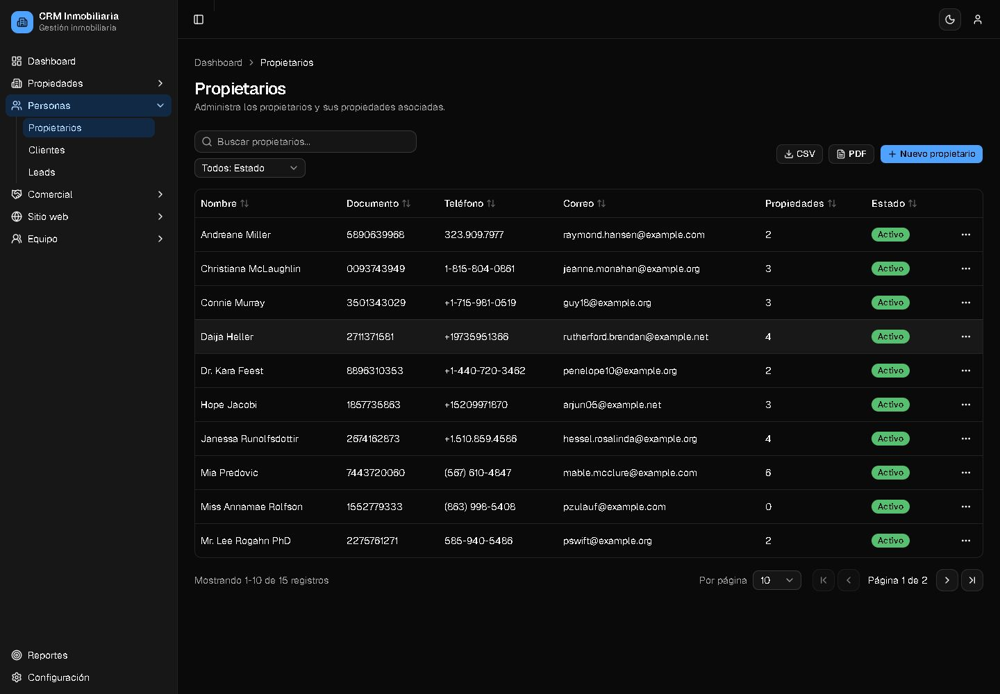

## 20.1 Funciones disponibles

- Listar propietarios.
- Buscar propietarios.
- Filtrar por estado.
- Exportar CSV/PDF.
- Crear propietario.
- Editar propietario.
- Eliminar si el rol lo permite.

## 20.2 Campos reales

- **Nombre**
- **Documento**
- **Teléfono**
- **WhatsApp**
- **Correo electrónico**
- **Estado**
- **Dirección**
- **Notas**

---

# Capítulo 21 - Clientes

El módulo **Clientes** administra personas interesadas en comprar o arrendar.

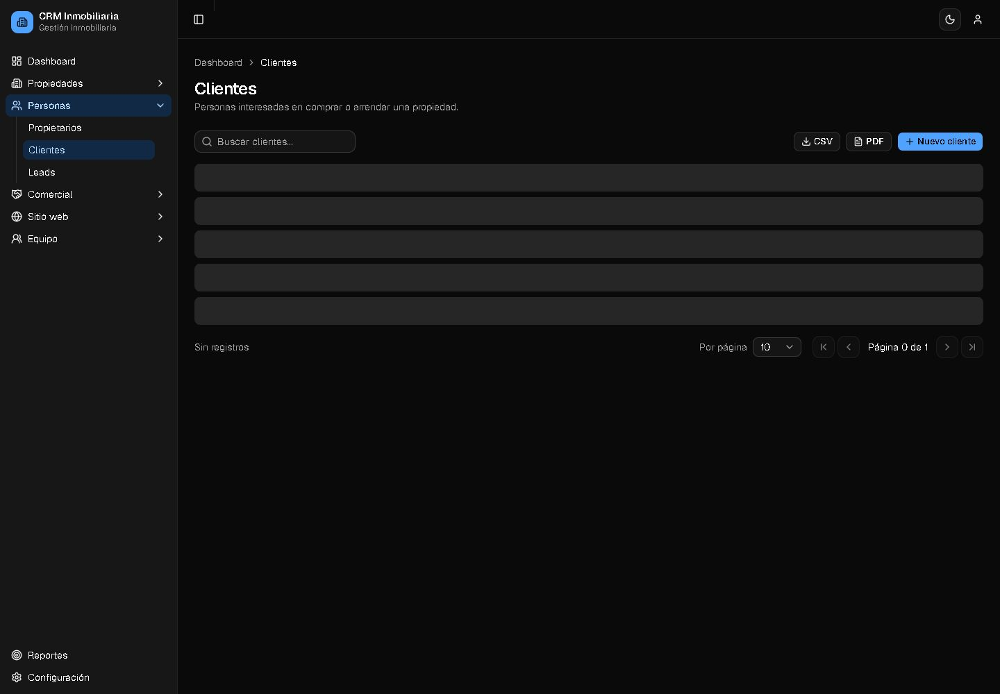

## 21.1 Funciones disponibles

- Listar clientes.
- Buscar clientes.
- Exportar CSV/PDF.
- Crear cliente.
- Editar cliente.
- Eliminar si el rol lo permite.

## 21.2 Campos reales

- **Nombre**
- **Documento**
- **Teléfono**
- **WhatsApp**
- **Correo**
- **Tipo de interés**
- **Tipo de propiedad**
- **Habitaciones**
- **Presupuesto mínimo**
- **Presupuesto máximo**
- **Zonas de interés**
- **Estado**
- **Notas**

---

# Capítulo 22 - Leads

Un lead es una persona que mostró interés, pero todavía no necesariamente es cliente.

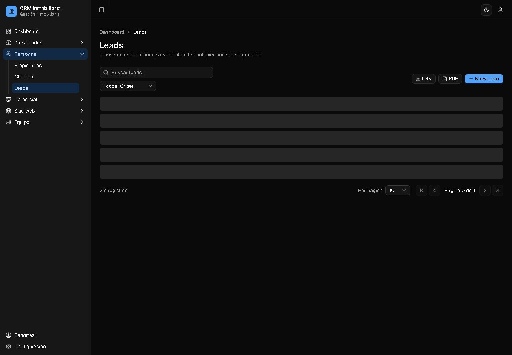

## 22.1 Funciones disponibles

- Listar leads.
- Buscar leads.
- Filtrar por estado.
- Exportar CSV/PDF.
- Crear lead manualmente.
- Editar lead.
- Convertir lead a cliente.
- Eliminar si el rol lo permite.

## 22.2 Campos reales

- **Nombre**
- **Teléfono**
- **Correo**
- **Origen**
- **Estado**
- **Notas**

## 22.3 Orígenes reales

- Web
- WhatsApp
- Llamada
- Referido
- Redes sociales
- Portal inmobiliario
- Manual
- Otro

---

# Capítulo 23 - Convertir un lead en cliente

La conversión permite pasar un lead calificado al módulo Clientes.

## 23.1 Cuándo usarlo

Use **Convertir a cliente** cuando la persona ya debe ser gestionada como cliente formal.

## 23.2 Paso a paso

1. Abra **Leads**.
2. Ubique el lead.
3. Abra el menú de acciones.
4. Seleccione **Convertir a cliente**.

## 23.3 Resultado esperado

El lead queda convertido y sus datos pasan al flujo de clientes.

> **Nota:** el botón no se muestra para leads que ya están convertidos.

---

# Capítulo 24 - Oportunidades

Las oportunidades representan procesos comerciales activos o cerrados.

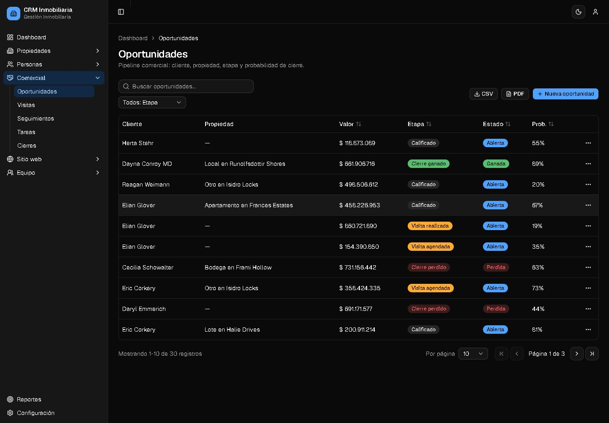

## 24.1 Funciones disponibles

- Listar oportunidades.
- Buscar oportunidades.
- Filtrar por etapa.
- Exportar CSV/PDF.
- Crear oportunidad.
- Editar oportunidad.
- Eliminar si el rol lo permite.

## 24.2 Campos reales

- **Cliente**
- **Propiedad**
- **Etapa**
- **Valor estimado**
- **Probabilidad (%)**
- **Próxima acción**
- **Fecha estimada de cierre**
- **Notas**

## 24.3 Etapas reales

- Nuevo
- Contactado
- Calificado
- Propiedades enviadas
- Visita agendada
- Visita realizada
- Negociación
- Cierre ganado
- Cierre perdido

## 24.4 Estados reales

- Abierta
- Ganada
- Perdida

---

# Capítulo 25 - Visitas

El módulo **Visitas** permite programar y registrar visitas a propiedades.

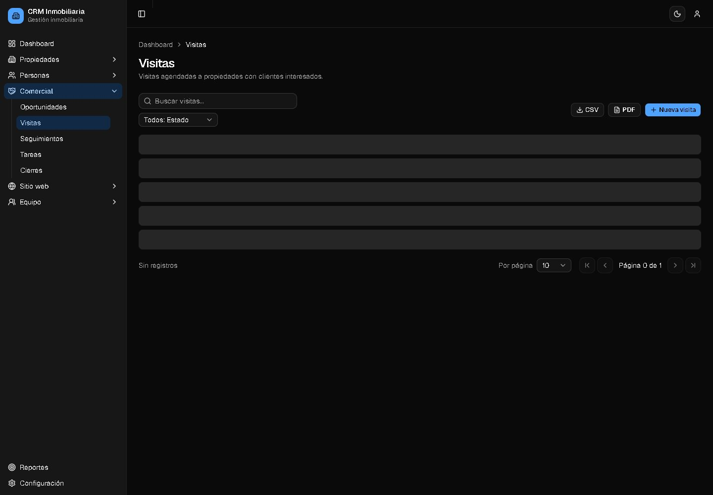

## 25.1 Funciones disponibles

- Listar visitas.
- Buscar visitas.
- Filtrar por estado.
- Exportar CSV/PDF.
- Crear visita.
- Editar visita.
- Eliminar si el rol lo permite.

## 25.2 Campos reales

- **Propiedad**
- **Cliente**
- **Fecha y hora**
- **Estado**
- **Observaciones**
- **Resultado**
- **Seguimiento posterior**

## 25.3 Estados reales

- Pendiente
- Confirmada
- Realizada
- Cancelada
- Reprogramada
- No asistió

---

# Capítulo 26 - Seguimientos / actividades

Los seguimientos registran la historia de contacto con clientes, propietarios o leads.

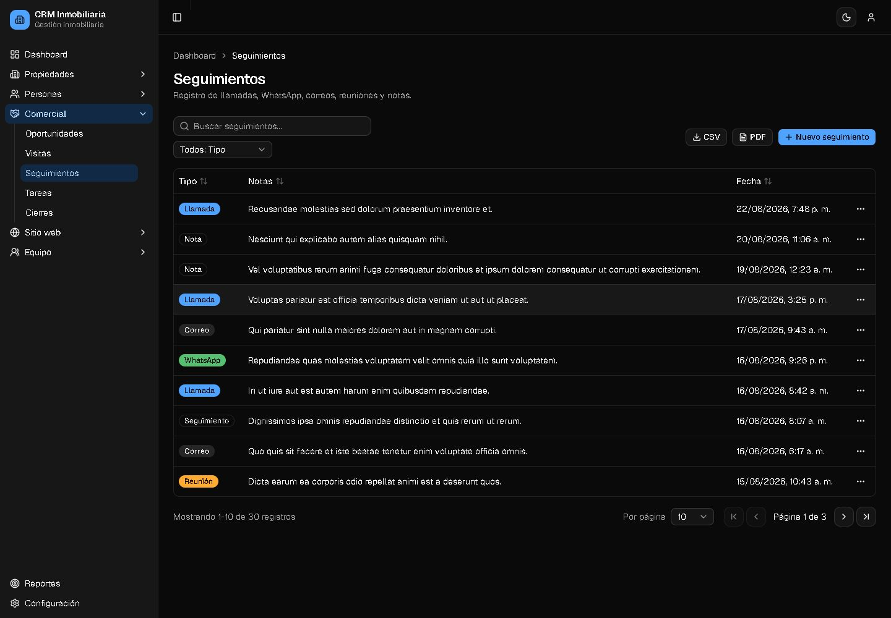

## 26.1 Tipos reales

- Llamada
- WhatsApp
- Correo
- Reunión
- Nota
- Seguimiento

## 26.2 Campos reales

- **Tipo**
- **Fecha**
- **Notas**

## 26.3 Para qué sirve

Sirve para dejar trazabilidad de la gestión comercial. Un equipo ordenado registra llamadas, mensajes, reuniones y notas importantes.

---

# Capítulo 27 - Tareas

Las tareas ayudan a controlar pendientes operativos.

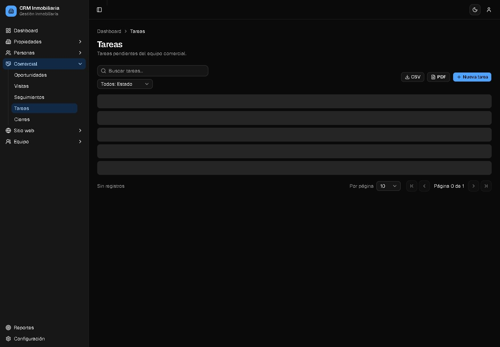

## 27.1 Funciones disponibles

- Listar tareas.
- Buscar tareas.
- Filtrar por estado.
- Exportar CSV/PDF.
- Crear tarea.
- Editar tarea.
- Eliminar si el rol lo permite.

## 27.2 Campos reales

- **Título**
- **Fecha límite**
- **Estado**
- **Descripción**

## 27.3 Estados reales

- Pendiente
- En progreso
- Completada
- Cancelada

---

# Capítulo 28 - Cierres

La pantalla **Cierres** muestra oportunidades cerradas.

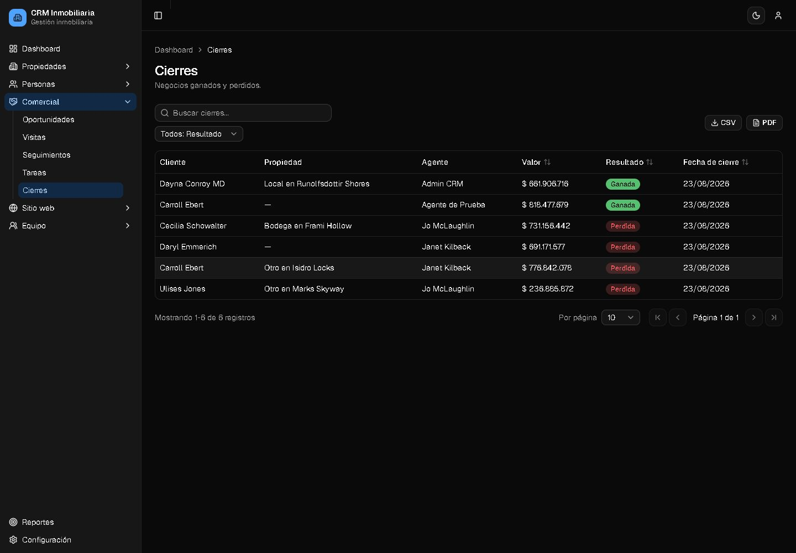

## 28.1 Funciones disponibles

- Buscar cierres.
- Filtrar por resultado.
- Exportar CSV/PDF.

## 28.2 Resultados reales

- Ganada
- Perdida

## 28.3 Cuándo usarla

Use esta pantalla para revisar negocios finalizados y analizar resultados.

---

# Capítulo 29 - Documentos

Los documentos se gestionan dentro de registros como propiedades.


## 29.1 Funciones reales

En la sección **Documentos** aparecen:

- **Subir documento**
- listado de archivos cargados;
- descarga de documentos;
- eliminación para administradores;
- mensaje **Sin documentos** cuando no hay archivos.

## 29.2 Advertencia

> **No cargue información que no deba quedar almacenada en el sistema.** Evite subir documentos sensibles si no son necesarios para la operación.

## 29.3 Permisos

- Administrador y agente pueden subir documentos.
- Solo administrador puede eliminar documentos.
- Asistente puede consultar según disponibilidad de la pantalla.

---

# Capítulo 30 - Blog desde el CRM

El módulo **Blog** permite administrar artículos visibles en la web pública.

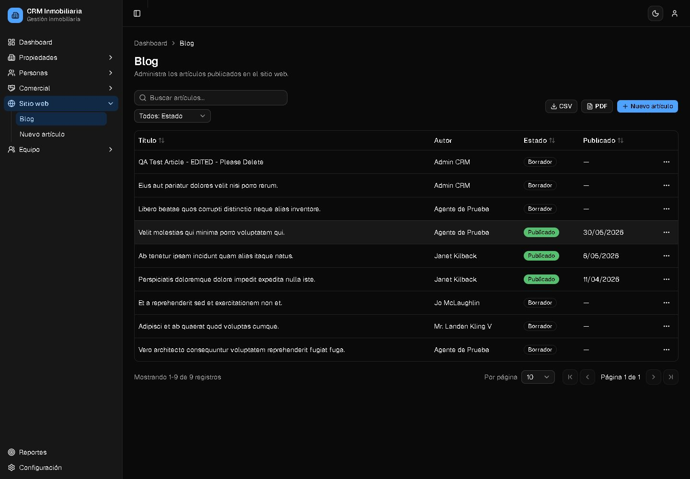

## 30.1 Funciones disponibles

- Listar artículos.
- Buscar artículos.
- Filtrar por estado.
- Exportar CSV/PDF.
- Crear artículo.
- Editar artículo.
- Eliminar si el rol lo permite.
- Subir imagen destacada desde la edición del artículo.

## 30.2 Campos reales

- **Título**
- **Extracto**
- **Contenido**
- **Estado**
- **Meta título**
- **Meta descripción**

## 30.3 Estados reales

- Borrador
- Publicado

## 30.4 Cómo aparece en la web pública

Un artículo publicado puede aparecer en el blog público. Un artículo en borrador no debe mostrarse públicamente.

---

# Capítulo 31 - Usuarios

El módulo **Usuarios** está disponible para administradores.

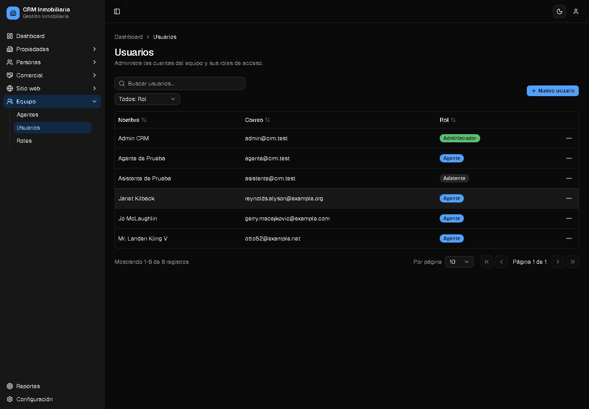

## 31.1 Funciones disponibles

- Listar usuarios.
- Buscar usuarios.
- Filtrar por rol.
- Crear usuario.
- Editar usuario.
- Eliminar usuario cuando esté permitido.

## 31.2 Campos reales

Al crear:

- **Nombre**
- **Correo electrónico**
- **Contraseña**
- **Rol**

Al editar:

- **Nombre**
- **Correo electrónico**
- **Nueva contraseña**
- **Rol**

> **Protección real:** el administrador no puede eliminarse a sí mismo.

---

# Capítulo 32 - Agentes

La pantalla **Agentes** muestra usuarios operativos de rol administrador o agente.

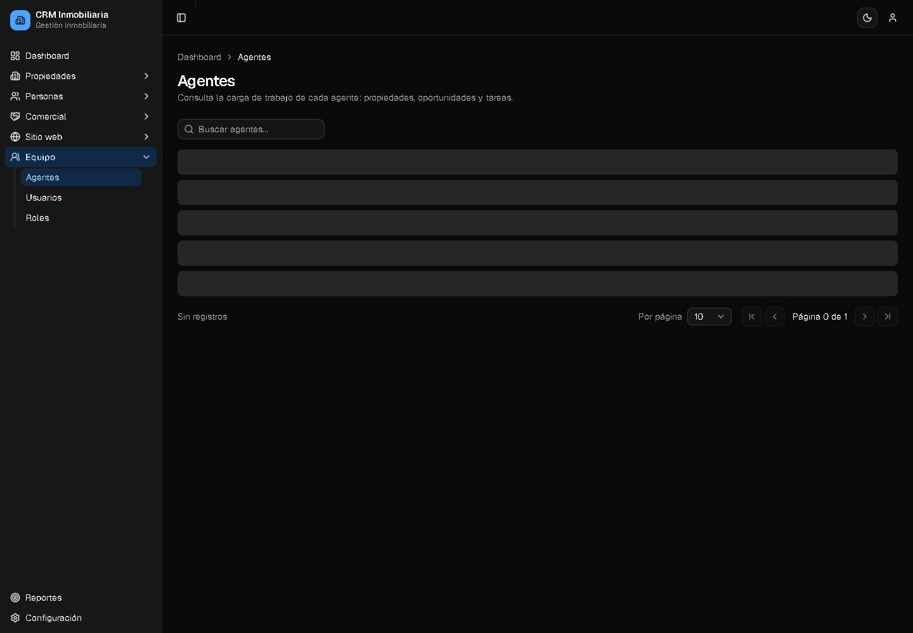

## 32.1 Para qué sirve

Permite consultar el equipo comercial disponible para asignaciones y reportes.

## 32.2 Información visible

La tabla muestra datos de usuario y rol. Los indicadores exactos dependen de la información disponible en la base de datos.

---

# Capítulo 33 - Roles y permisos

La pantalla **Roles** presenta una matriz simple para entender qué puede hacer cada tipo de usuario.


## 33.1 Resumen

- Admin: ver, crear, editar, eliminar y administrar equipo.
- Agente: ver, crear y editar registros operativos.
- Asistente: ver información operativa.

---

# Capítulo 34 - Reportes

La pantalla **Reportes** agrupa indicadores para análisis.

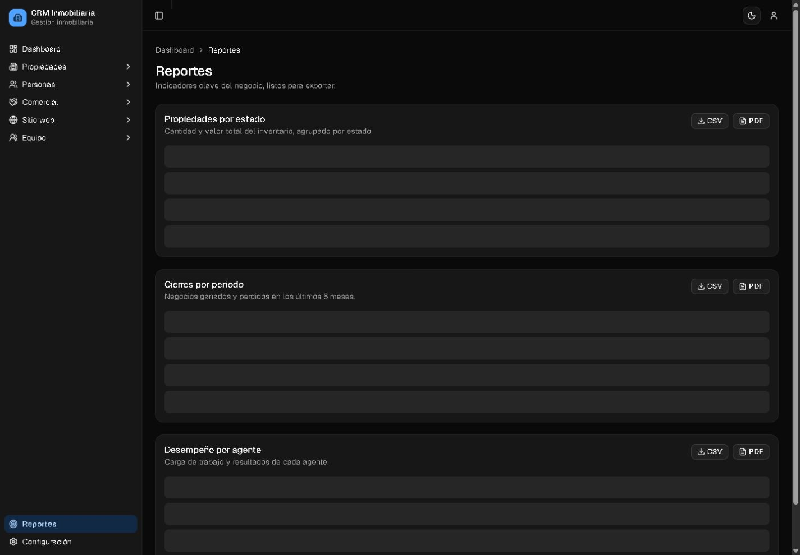

## 34.1 Reportes reales

### Propiedades por estado

Mide cuántas propiedades existen en cada estado.

### Cierres por periodo

Ayuda a revisar cierres comerciales en el tiempo.

### Desempeño de agentes

Permite analizar actividad comercial por agente.

## 34.2 Exportación

Cada tarjeta de reporte puede incluir botones de exportación.

---

# Capítulo 35 - Exportaciones

Los módulos principales tienen botones **CSV** y **PDF**.

## 35.1 Módulos con exportación observada

- Propiedades
- Propietarios
- Clientes
- Leads
- Oportunidades
- Visitas
- Seguimientos
- Tareas
- Cierres
- Blog
- Reportes

## 35.2 Paso a paso

1. Abra el módulo.
2. Aplique búsqueda o filtros si corresponde.
3. Presione **CSV** o **PDF**.
4. Descargue el archivo.

> **Consejo:** aplique filtros antes de exportar para obtener un archivo más preciso.

---

# Capítulo 36 - Configuración y perfil

La pantalla **Configuración** permite actualizar datos del usuario.

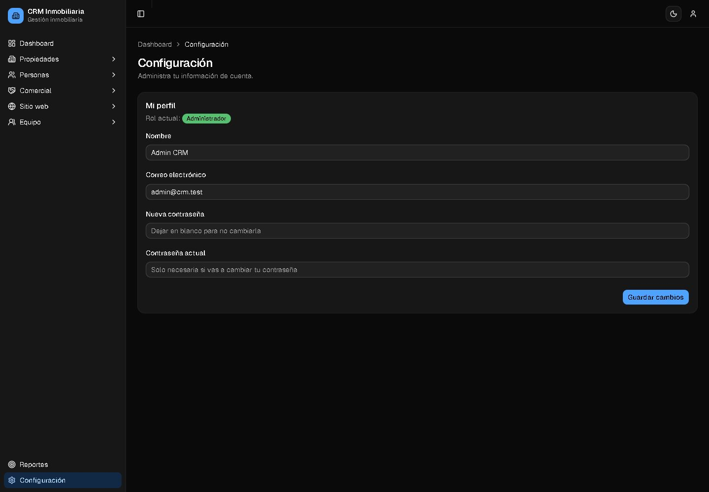

## 36.1 Campos reales

- **Nombre**
- **Correo electrónico**
- **Nueva contraseña**
- **Contraseña actual**

## 36.2 Cambiar nombre o correo

1. Abra **Configuración**.
2. Edite nombre o correo.
3. Presione **Guardar cambios**.

## 36.3 Cambiar contraseña

1. Ingrese la **nueva contraseña**.
2. Ingrese su **contraseña actual**.
3. Presione **Guardar cambios**.

Si no desea cambiar la contraseña, deje el campo **Nueva contraseña** vacío.

---

# Capítulo 37 - Flujos completos

## 37.1 Flujo 1 - Publicar una propiedad

```text
Propietario
↓
Crear propietario
↓
Crear propiedad
↓
Completar información
↓
Agregar fotografías
↓
Activar “Publicar en el sitio web”
↓
Aparece en la web pública
```

Pasos:

1. Cree o seleccione el propietario.
2. Cree la propiedad.
3. Complete ubicación, precio y características.
4. Guarde.
5. Entre a edición y suba fotos.
6. Active **Publicar en el sitio web**.
7. Si aplica, active **Propiedad destacada**.

## 37.2 Flujo 2 - Atender un cliente

```text
Lead
↓
Contacto
↓
Cliente
↓
Propiedad
↓
Visita
↓
Oportunidad
↓
Negociación
↓
Cierre
```

Pasos:

1. Revise el lead.
2. Registre seguimientos.
3. Conviértalo a cliente si califica.
4. Cree una visita si desea conocer una propiedad.
5. Cree una oportunidad.
6. Actualice etapa y probabilidad.
7. Cierre como ganado o perdido según resultado.

## 37.3 Flujo 3 - Captar propietario desde la web

```text
Visitante
↓
Vender mi propiedad
↓
Formulario
↓
Lead en CRM
↓
Contacto comercial
↓
Captación
```

El visitante completa la página **Vender mi propiedad**. La información entra como solicitud para que el equipo la gestione comercialmente.

---

# Capítulo 38 - Búsqueda, filtros y paginación

## 38.1 Búsqueda

La mayoría de tablas incluyen un campo de búsqueda con textos como:

- Buscar propiedades
- Buscar propietarios
- Buscar clientes
- Buscar leads
- Buscar oportunidades
- Buscar visitas
- Buscar seguimientos
- Buscar tareas
- Buscar cierres
- Buscar artículos
- Buscar usuarios
- Buscar agentes

## 38.2 Filtros

Los filtros varían por módulo:

- Propiedades: Estado, Venta/Arriendo.
- Propietarios: Estado.
- Leads: Estado.
- Oportunidades: Etapa.
- Visitas: Estado.
- Seguimientos: Tipo.
- Tareas: Estado.
- Cierres: Resultado.
- Blog: Estado.
- Usuarios: Rol.

## 38.3 Paginación

Las tablas muestran controles de paginación y selector **Por página**.

---

# Capítulo 39 - Estados del sistema

## 39.1 Propiedades

- Borrador
- Disponible
- Reservado
- Vendido
- Arrendado
- Inactivo

## 39.2 Propietarios

- Activo
- Inactivo

## 39.3 Clientes

- Activo
- Inactivo

## 39.4 Leads

- Nuevo
- Contactado
- Calificado
- Descartado
- Convertido

## 39.5 Oportunidades

Etapas:

- Nuevo
- Contactado
- Calificado
- Propiedades enviadas
- Visita agendada
- Visita realizada
- Negociación
- Cierre ganado
- Cierre perdido

Estados:

- Abierta
- Ganada
- Perdida

## 39.6 Visitas

- Pendiente
- Confirmada
- Realizada
- Cancelada
- Reprogramada
- No asistió

## 39.7 Tareas

- Pendiente
- En progreso
- Completada
- Cancelada

## 39.8 Blog

- Borrador
- Publicado

---

# Capítulo 40 - Mensajes del sistema

El sistema usa mensajes visuales para informar al usuario.

## 40.1 Éxito

Indica que la operación se completó correctamente, por ejemplo al guardar un formulario.

## 40.2 Error

Indica que algo no pudo completarse. Puede ocurrir por permisos, datos incompletos o problemas de conexión.

## 40.3 Validación

Aparece cuando un campo requerido falta o tiene un formato incorrecto.

## 40.4 Confirmación

Al eliminar registros se muestra una confirmación con el texto **¿Eliminar este registro?** y botón **Eliminar**.

---

# Capítulo 41 - Solución de problemas

| Problema | Posible causa | Qué hacer |
| --- | --- | --- |
| No puedo crear un registro | El rol es Asistente | Solicite a un admin o agente que lo cree |
| No veo “Eliminar” | Solo Admin puede eliminar | Pida apoyo a un administrador |
| No veo el módulo Equipo | Solo Admin puede acceder | Verifique el rol asignado |
| Una propiedad no aparece en la web | No está publicada | Active “Publicar en el sitio web” |
| Una propiedad no aparece destacada | No está marcada como destacada | Active “Propiedad destacada” |
| No puedo cambiar contraseña | Falta contraseña actual | Ingrese la contraseña actual |
| No puedo exportar | Puede haber error de sesión o permisos | Recargue, inicie sesión o consulte a soporte |
| No se ve una foto pública | La propiedad no tiene imágenes | Suba una foto desde edición |
| El formulario público no envía | Datos incompletos o conexión | Revise campos requeridos e intente de nuevo |

---

# Capítulo 42 - Preguntas frecuentes

## ¿Cómo publico una propiedad?

Edite la propiedad y active **Publicar en el sitio web**.

## ¿Cómo marco una propiedad como destacada?

Edite la propiedad y active **Propiedad destacada**.

## ¿Cómo convierto un lead?

Abra **Leads**, entre al menú de acciones y seleccione **Convertir a cliente**.

## ¿Cómo agendo una visita?

Abra **Visitas**, presione **Nueva visita**, seleccione propiedad, cliente, fecha y estado.

## ¿Qué diferencia hay entre cliente y lead?

Un lead mostró interés inicial. Un cliente ya se gestiona formalmente en el CRM.

## ¿Quién puede eliminar registros?

Solo usuarios con rol Administrador.

## ¿Cómo exporto información?

Use los botones **CSV** o **PDF** disponibles en cada módulo.

## ¿Cómo cambio mi contraseña?

Vaya a **Configuración**, escriba nueva contraseña y contraseña actual, y guarde.

## ¿Cómo publico un artículo del blog?

Cree o edite un artículo y cambie su estado a **Publicado**.

## ¿Por qué una propiedad no aparece públicamente?

Normalmente porque no está marcada como publicada.

---

# Capítulo 43 - Buenas prácticas

- Mantenga actualizada la información de propiedades.
- Revise precio, ubicación y características antes de publicar.
- Use estados correctamente.
- Registre seguimientos después de cada contacto importante.
- Cierre tareas terminadas.
- Registre resultado y seguimiento posterior de visitas.
- No comparta cuentas.
- Use contraseñas seguras.
- Revise información antes de exportar.
- No elimine registros sin confirmar que ya no son necesarios.

---

# Capítulo 44 - Glosario

| Término | Significado |
| --- | --- |
| Lead | Persona interesada que todavía no es cliente formal |
| Cliente | Persona gestionada comercialmente para compra o arriendo |
| Propietario | Persona dueña de un inmueble |
| Propiedad | Inmueble administrado por la inmobiliaria |
| Oportunidad | Proceso comercial con valor y etapa |
| Pipeline | Flujo de avance de una oportunidad |
| Cierre | Resultado final de una oportunidad |
| Propiedad destacada | Inmueble marcado para aparecer en el inicio |
| Publicación | Acción que permite mostrar una propiedad en la web |
| Visita | Cita para conocer una propiedad |
| Seguimiento | Registro de llamada, WhatsApp, correo, reunión o nota |
| Agente | Usuario comercial que gestiona registros |
| CRM | Sistema para administrar relaciones y operación comercial |

---

# Capítulo 45 - Soporte

Complete esta sección con los datos oficiales de soporte de la inmobiliaria:

| Canal | Dato |
| --- | --- |
| Correo de soporte | `[pendiente por definir]` |
| Teléfono | `[pendiente por definir]` |
| Horario | `[pendiente por definir]` |
| Responsable interno | `[pendiente por definir]` |

> **Nota:** estos placeholders son intencionales porque el sistema no contiene datos específicos de soporte técnico.

---

# Capítulo 46 - Anexo: arquitectura general del sistema

Vista de alto nivel:

```text
Sitio web público
        ↘
         Sistema inmobiliario
        ↗
CRM privado
```

El usuario no necesita conocer detalles técnicos. Solo debe recordar:

- el CRM administra la información;
- la web pública muestra información publicada;
- los formularios públicos ayudan a generar leads;
- el equipo comercial trabaja esos leads dentro del CRM.

---

## QA del manual

Antes de entregar este documento se verificó:

- Capturas reales de la aplicación actual.
- Campos y botones basados en la interfaz real.
- Estados basados en la implementación real.
- Permisos basados en la matriz real del sistema.
- No se incluyeron contraseñas en capturas.
- No se documentaron endpoints ni detalles técnicos para usuario final.
- Las funciones no observadas como independientes se describieron según su ubicación real.

